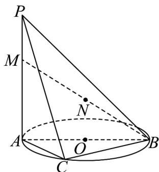

<!-- question-source:start -->
19．（17分）如图， $AB$ 是 $\odot O$ 的直径， $PA$ 垂直于 $\odot O$ 所在的平面，点 $C$ 是圆周上的点且 $AC = CB = 3$ ，

$M$ 在线段 $PA$ 上且 $AM = 2MP$ ， $N$ 是 $BM$ 的中点.

(1)若二面角 $P - BC - A$ 的大小为 $45^{\circ}$ ，求直线 $BM$ 与平面 $PAC$ 所成角的正弦值；

$$
P Q
$$

(2)线段 $PC$ 上是否存在点 $Q$ ，使得 $NQ \parallel$ 平面 $ABC$ ？若存在，则求 $\overline{QC}$ 的值；若不存在，请说明理由。
<!-- question-source:end -->

![[高中/课堂同步/题库/人教A版高中数学同步讲义(2026)/02_必修第二册/第八章 立体几何初步/第八章 立体几何初步（高效培优单元自测·强化卷）/三_填空题/questions/answers/Q00069909A1.md]]
