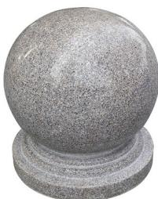
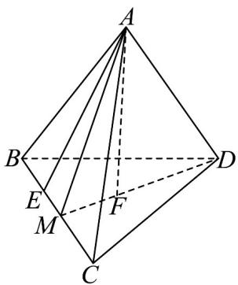

> [!faq]- 《第八章 立体几何初步（高效培优单元自测·强化卷）》官方解析
>
> > [!success]- **【答案】** 80cm，内直径为 $60cm$ ，石球材料的密度为 $2.7g/cm^{3}$ ，则该石球的质量为 \_\_\_\_ 千克（ $\pi\approx3.14$ ，答 案精确到 $0.01$ 千克） 
>
> > [!note]- **【分析】**
> > 根据球的体积公式即可结合质量公式求解·
>
> > [!note]- **【解析】**
> > 由题意可知： $\rho = 2.7\mathrm{g / cm^3},V = \frac{4\pi}{3}\left(40^{3} - 30^{3}\right)\mathrm{cm}^{3}$
> >
> > 故石球的质量为 $m = \rho V = 2.7\mathrm{g / cm^3}\times \frac{4\pi}{3}\left(40^3 -30^3\right)\mathrm{cm}^3 = 2.7\mathrm{g}\times \frac{4\pi}{3}\left(40^3 -30^3\right)\approx 418.25\mathrm{kg}$
> >
> > 故答案为：418.25
> >
> > 14. 侧棱长为 $^2$ 的正三棱锥 $A - BCD$ 中，棱 $BC$ 上存在点 $E$ ，使得 $AE \perp AD$ ，以 $A$ 为球心的球与平面 $BCD$
> >
> > 相切，则该球被三棱锥 A-BCD 截得的几何体的体积为 \_\_\_\_。
> >
> > $$
> > \frac {8 \sqrt {3} \pi}{2 7}
> > $$
> >
> > 【答案】 27
> >
> > 【分析】取线段 BC 的中点 M ，过点 A 作 $AF \perp$ 平面 BCD ，先求证 $BC \perp$ 平面 AMD ，进而求证 $AD \perp$ 平面
> >
> > ABC，再计算球的半径，最后计算球的体积即可求出.
> >
> > 【详解】取线段 BC 的中点 M ，连接 AM, DM
> >
> > 因为 VABC 为等腰三角形， $\triangle BCD$ 为等边三角形，所以 $AM \perp BC$ ， $DM \perp BC$ ，
> >
> > 又 $AM \cap DM = M$ ，AM, DM ⊂ 平面 AMD，所以 BC ⊥ 平面 AMD，
> >
> > 因为 $AD \subset$ 平面 AMD ，所以 $BC \perp AD$
> >
> > 因为 $AE \perp AD$ ， $AE \cap BC = E, AE, BC \subset$ 平面 $ABC$ ，所以 $AD \perp$ 平面 $ABC$
> >
> > 又 $AB, AC \subset$ 平面 ABC ，所以 $AD \perp AB, AD \perp AC$
> >
> > 因为 $AB = AC = AD = 2$ ，所以 $BC = CD = BD = 2\sqrt{2}$ ，所以 $AB \perp AC$
> >
> > 过点 A 作 $AF \perp$ 平面 BCD ，垂足为 F ，则 $F \in MD$
> >
> > 因为 $MD = \sqrt{6}$ ，所以 $DF = \frac{2\sqrt{6}}{3}, MF = \frac{\sqrt{6}}{3}$
> >
> > 则 $AF = \sqrt{AD^2 - DF^2} = \sqrt{4 - \frac{24}{9}} = \frac{2\sqrt{3}}{3}$ ，即以 $A$ 为球心的球的半径为 $\frac{2\sqrt{3}}{3}$
> >
> > 则该球的体积为 $\frac{4\pi}{3} \times \left(\frac{2\sqrt{3}}{3}\right)^3 = \frac{32\sqrt{3}\pi}{27}$
> >
> > 则该球被三棱锥 A-BCD 截得的几何体的体积为 $\frac{1}{4} \times \frac{32\sqrt{3}\pi}{27} = \frac{8\sqrt{3}\pi}{27}$
> >
> > 
> >
> > 故答案为：27
> >
> > $$
> > \frac {8 \sqrt {3} \pi}{2 7}
> > $$
> >
> > 四、解答题：本题共5小题，共77分。解答应写出文字说明、证明过程或演算步骤。
