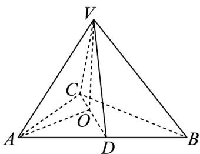

> [!faq]- 《第八章 立体几何初步（高效培优单元自测·强化卷）》官方解析
>
> > [!success]- **【答案】** (1) $\frac{\pi}{6}$ (2)证明详见解析
>
> > [!note]- **【分析】**
> > 利用几何法找到线面成角，利用线面垂直证明面面垂直·
>
> > [!note]- **【解析】**
> > （1）连接 $AO$ ，如图·
> >
> > 
> >
> > 由题可知， $VO \perp$ 平面 ABC ， $AB \subset$ 平面 ABC，则 $VO \perp AB$
> >
> > 且 $\angle VDO$ 即为直线 VD 与平面 ABC 所成角，
> >
> > 即 $\angle VDO = \frac{\pi}{4}$ · 由 AC = BC ， CD 为 AB 边的中线，
> >
> > 可得 $AB \perp CD$ 而 DV = DA = 2 ，可得 $OV = OD = \sqrt{2}$ ， $AO = \sqrt{AD^{2} + OD^{2}} = \sqrt{6}$
> >
> > 而 $\angle VAO$ 即为直线 $VA$ 与平面 $ABC$ 所成角，且 $\angle VAO\in \left[0,\frac{\pi}{2}\right]$
> >
> > 则 $\tan\angle VAO=\frac{\sqrt{2}}{\sqrt{6}}=\frac{\sqrt{3}}{3}$ ，可得直线 VA 与平面 ABC 所成角为 $\frac{\pi}{6}$ .
> >
> > (2) 由 $VO \perp AB$ ， $AB \perp CD$ ， $CD \cap VO = O$ ， $CD, VO \subset$ 平面 $VCD$ ，故 $AB \perp$ 平面 $VCD$
> >
> > 而 $AB \subset$ 平面 VAB ，则平面 $VCD \perp$ 平面 VAB.
