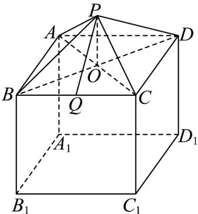

> [!faq]- 《第八章 立体几何初步（高效培优单元自测·强化卷）》官方解析
>
> > [!success]- **【答案】** (1) $5100\left(\mathrm{cm}^{2}\right)$ (2) $\left(1500\sqrt{7}+22500\right)\left(\mathrm{cm}^{3}\right)$
>
> > [!note]- **【分析】**
> > （1）取 $BC$ 的中点 $Q$ ，连接 $PQ$ ，先求出 $PQ$ ，进而求得正四棱锥的侧面积，再求长方体底座的侧面
> >
> > 积和底面积，把它们相加，即得这种“笼具”的表面积；
> >
> > (2) 根据图形和相关边长求出正四棱锥的高，再利用棱锥和长方体的体积公式计算即得
>
> > [!note]- **【解析】**
> > （1）如图，取 BC 的中点 Q，连接 PQ
> >
> > 
> >
> > 由正四棱锥 P-ABCD 知 PB=PC，所以 $PQ \perp BC$ ，且 $BQ = \frac{1}{2} BC = 15$ ，
> >
> > 又 $BC = 30\mathrm{cm}$ ， $BP = PC = 25\mathrm{cm}$
> >
> > 所以 $PQ = \sqrt{BP^2 - BQ^2} = \sqrt{25^2 - 15^2} = 20(\mathrm{cm})$
> >
> > 所以 $S_{\triangle PBC} = \frac{1}{2} BC \times PQ = \frac{1}{2} \times 30 \times 20 = 300(\mathrm{cm}^2)$
> >
> > 故正四棱锥 P-ABCD 的侧面积为 $4S_{\triangle PBC}=1200\left(\mathrm{cm}^{2}\right)$ .
> >
> > 又长方体 $ABCD-A_{1}B_{1}C_{1}D_{1}$ 的侧面积为 $4\times30\times25=3000\left(\mathrm{cm}^{2}\right)$ ，底面积为 $30\times30=900\left(\mathrm{cm}^{2}\right)$
> >
> > 所以这种“笼具”的表面积为 $1200 + 3000 + 900 = 5100 \left( cm^{2} \right)$ .
> >
> > (2) 连接 AC, BD, 设 AC, BD 的交点为 O, 连接 PO, 易知 $OP \perp$ 平面 ABCD,
> >
> > 又 $OB \subset$ 平面 ABCD ，所以 $OP \perp OB$
> >
> > 因为 $AB = BC = 30\mathrm{cm}$ ，所以 $OB = 15\sqrt{2}\mathrm{cm}$ ，又 $BP = 25\mathrm{cm}$ ，所以 $OP = 5\sqrt{7}\mathrm{cm}$
> >
> > 则正四棱锥 $P - ABCD$ 的体积为 $V_{1} = \frac{1}{3} AB\cdot BC\cdot OP = \frac{1}{3}\times 30^{2}\times 5\sqrt{7} = 1500\sqrt{7}\left(\mathrm{cm}^{3}\right)$
> >
> > 长方体 $ABCD - A_{1}B_{1}C_{1}D_{1}$ 的体积 $V_{2} = AB\cdot BC\cdot BB_{1} = 30^{2}\times 25 = 22500(\mathrm{cm}^{3})$
> >
> > 所以这种“笼具”的体积为 $V = V_{1} + V_{2} = \left(1500\sqrt{7} + 22500\right)\left(\mathrm{cm}^{3}\right)$ .
