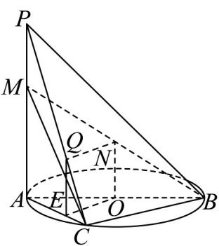

> [!faq]- 《第八章 立体几何初步（高效培优单元自测·强化卷）》官方解析
>
> > [!success]- **【答案】** (1) $\frac{3\sqrt{22}}{22}$ (2)存在； $\frac{PQ}{QC}=2$
>
> > [!note]- **【分析】**
> > （1）先证 $BC \perp$ 平面 PAC，确定线面角为 $\angle BMC$ ，计算相关线段 CM、BM 长度，用正弦定义
> >
> > 求解；
> >
> > (2) 构造平行四边形 NOEQ，由线面平行判定定理得 $NQ \parallel$ 平面 ABC，确定 $\frac{PQ}{QC} = 2$
>
> > [!note]- **【解析】**
> > （1）∵ PA 垂直于 $\odot O$ 所在的平面，又 AB 是 $\odot O$ 的直径，
> >
> > ∴ $BC \perp AC, \therefore$ 根据三垂线定理可得 $BC \perp PC$ ，又 $AC \cap PC = C$ ， $AC, PC \subset PAC$ ，平面
> >
> > $\therefore BC \perp$ 平面 PAC， $PC \subset$ 平面 PAC，故 $BC \perp PC$ ，
> >
> > ∴ 二面角 P - BC - A 的平面角为 $\angle PCA = 45^{\circ}$ ，且直线 BM 与平面 PAC 所成角为 $\angle BMC$
> >
> > 又 $AC = CB = 3, \therefore PA = 3$ ，又 $AM = 2MP$ ， $\therefore AM = 2$
> >
> > $$
> > \therefore C M = \sqrt {A M ^ {2} + A C ^ {2}} = \sqrt {4 + 9} = \sqrt {1 3} \quad \therefore B M = \sqrt {C M ^ {2} + C B ^ {2}} = \sqrt {1 3 + 9} = \sqrt {2 2}
> > $$
> >
> > $\therefore \sin \angle BMC = \frac{CB}{BM} = \frac{3}{\sqrt{22}} = \frac{3\sqrt{22}}{22}$
> >
> > $$
> > 3 \sqrt {2 2}
> > $$
> >
> > ∴直线 BM 与平面 PAC 所成角的正弦值为 22
> >
> > (2) 在线段 PC 上存在点 Q，使得 $NQ \parallel$ 平面 ABC，且 $\frac{PQ}{QC} = 2$ ，理由如下：
> >
> > 取 $PC$ 的靠近 $C$ 的三等分点 $Q$ ，过 $Q$ 作 $QE \parallel PA$ ，且 $QEI AC = E$
> >
> > 则 $QE \parallel PA$ ，且 $QE = \frac{1}{3} PA$
> >
> > 
> >
> > 又 N 是 BM 的中点，O 为 AB 中点，∴ NO // AM ，又 AM = 2MP ，
> >
> > $\therefore NO // AM$ ，且 $NO = \frac{1}{2} AM = \frac{1}{3} PA, \therefore QE \parallel NO$ ，且 $QE = NO$
> >
> > ∴ $NOEQ$ 四边形 为平行四边形，
> >
> > $\therefore NQ \parallel OE$ ，又 $NQ \not\subset$ 平面 ABC， $OE \subset$ 平面 ABC， $\therefore NQ \parallel$ 平面 ABC，
> >
> > 故在线段 $PC$ 上存在点 $Q$ ，使得 $NQ \parallel$ 平面 $ABC$ ，且 $\frac{PQ}{QC} = 2$
