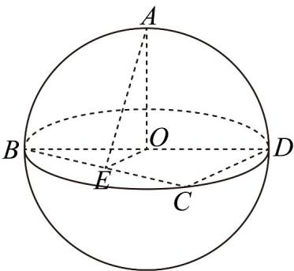

<!-- question-source:start -->
9．如图，已知点 $A, B, C, D$ 在表面积为 $12\pi$ 的球 $O$ 的球面上，且 $O \in BD$ ， $OA \perp$ 平面 $BCD$ ，点 $E$ 为 $BC$ 中点，

当二面角 $A - BC - D$ 的大小为 $\frac{\pi}{3}$ 时，则有（）

A. 异面直线 $AE$ 和 $CD$ 所成角的大小为 $\frac{\pi}{3}$ B. 直线 $EA$ 与平面 $ABD$ 所成角的大小为 $\frac{\pi}{6}$

C. $\sin (2\angle ABE) = \frac{2\sqrt{2}}{3}$

D. $\triangle BED$ 的面积为 $\sqrt{2}$
<!-- question-source:end -->

![[高中/课堂同步/题库/人教A版高中数学同步讲义(2026)/02_必修第二册/第八章 立体几何初步/第八章 立体几何初步（高效培优单元自测·提升卷）/一_选择题/questions/answers/Q00069915A1.md]]
