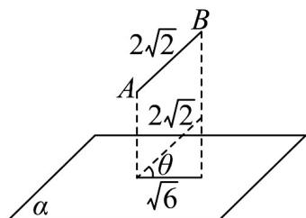
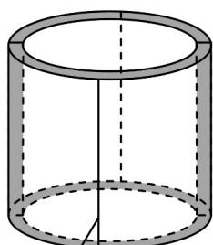

> [!faq]- 《第八章 立体几何初步（高效培优单元自测·提升卷）》官方解析
>
> > [!success]- **【答案】** A. $30^{\circ}$ B. $45^{\circ}$ C. $60^{\circ}$ D. $75^{\circ}$
>
> > [!note]- **【分析】**
> > 根据线面角的定义，结合特殊角的余弦值进行求解即可·
>
> > [!note]- **【解析】**
> > 设直线 $AB$ 与 $\alpha$ 所成角为 $\theta (0^{\circ}\leq \theta \leq 90^{\circ})$
> >
> > 因为线段 $AB = 2\sqrt{2}$ ，且线段 $AB$ 在平面 $\alpha$ 上的射影长为 $\sqrt{6}$
> >
> > 故 $\cos\theta=\frac{\sqrt{6}}{2\sqrt{2}}=\frac{\sqrt{3}}{2}$ ，所以 $\theta=30^{\circ}$
> >
> > 故选：A
> >
> > 
> >
> > 3. 《天工开物》是我国明代科学家宋应星所著的一部综合性科学技术著作，书中记载了一种制造瓦片的
> >
> > 方法．首先，准备一个圆桶模具，圆桶底面外圆的直径为 $30cm$ ，高为 10cm，在圆桶的外侧面均匀包上一
> >
> > 层厚度为 $3\mathrm{cm}$ 的粘土，然后，沿圆桶母线方向将粘土层分割成四等份（如图），等粘土晾干后，即可得到
> >
> > 大小相同的 $^{4}$ 片瓦．若需要制作 $^{800}$ 片这种瓦片，则所需粘土的体积为（）
> >
> > 
> > 分割线 一片瓦
> >
> > A. $45\pi \mathrm{dm}^3$ B. $99\pi \mathrm{dm}^3$ C. $135\pi \mathrm{dm}^3$ D. $198\pi \mathrm{dm}^3$
> >
> > 【答案】D
> >
> > 【分析】根据题意，利用圆柱的体积公式，求得四片瓦需要的粘土量，进而求得 $^{800}$ 片瓦需要的粘土量，
> >
> > 得到答案·
> >
> > 【详解】由圆柱的体积公式，可得四片瓦需要的粘土量为 $\pi \times (15 + 3)^{2} \times 10 - \pi \times 15^{2} \times 10 = 990\pi cm^{3}$
> >
> > 所以 $800$ 片瓦需要的粘土量为 $990\pi \times 200 = 198000\pi \mathrm{cm}^3 = 198\pi \mathrm{dm}^3$
> >
> > 故选：D.
> >
> > 4. 观星台是我国现存最古老的天文台，包含观星台在内的登封“天地之中”历史建筑群已被列为世界文化遗
> >
> > 产·已知观星台台体一部分可以看作一个正四棱台，台高 $9.46$ 米，台下正四边形边长 $16$ 米多，台上正四边形
> >
> > 边长约为台下正四边形边长之半，则该四棱台的体积可能为（ ）
> > A. $1388 \, 米^{3}$ B. $1398 \, 米^{3}$ C. $1406 \, 米^{3}$ D. $1456 \, 米^{3}$
> >
> > 【答案】D
> >
> > 【分析】根据正四棱台的体积公式与下底边长的范围求得正四棱台体积的范围即可判断·
> >
> > 【详解】设正四棱台的下底面边长为 a，高为 h，则上底面边长近似为 $\frac{a}{2}$ ，16 < a < 17，h = 9.46；
> >
> > 所以正四棱台的体积 $V=\frac{1}{3}\times\left(a^{2}+\frac{a^{2}}{4}+\frac{a^{2}}{2}\right)h=\frac{7\times9.46a^{2}}{12}$ ，解得1412.7<V<1594.8
> >
> > 故选 **D**.
