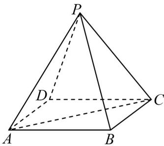
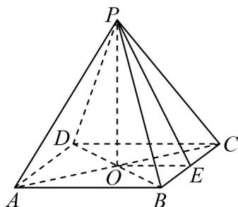
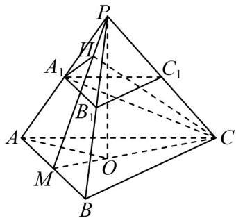
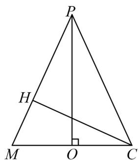

> [!faq]- 《第八章 立体几何初步（高效培优单元自测·提升卷）》官方解析
>
> > [!success]- **【答案】**  A. $\frac{\pi}{12}$ B. $\frac{\pi}{4}$ C. $\frac{\pi}{6}$ D. $\frac{\pi}{3}$
>
> > [!note]- **【分析】**
> > 根据正四棱锥的结构特征，作出侧面与底面所成的二面角的平面角，解直角三角形即可得答案。
>
> > [!note]- **【解析】**
> > 如图，设正四棱锥 P-ABCD 底面对角线的交点为 O，BC 的中点为 E，
> > 连接 PO、PE、OE，则 $PO \perp$ 底面 ABCD，
> > 则 OE 为 PE 在底面 ABCD 上的射影，且 $PE \perp BC, OE \perp BC$ 故 $\angle PEO$ 即为正四棱锥 P-ABCD 侧面与底面所成的二面角的平面角，
> >
> > 
> >
> > 设正方形ABCD的边长为2，高 $PO = h$ ， $AC = 2\sqrt{2}$
> >
> > 则由 $\triangle PAC$ 的面积与正四棱锥的侧面面积之和的比为 1:4，
> >
> > 得 $\frac{\frac{1}{2} \times 2\sqrt{2} \times h}{4 \times \frac{1}{2} \times 2 \times \sqrt{h^2 + 1}} = \frac{1}{4}$ ，解得 $h = 1$ ，
> >
> > 故在 $\mathrm{Rt}^{\triangle}$ PEO中， $\tan \angle PEO = \frac{PO}{OE} = \frac{1}{1} = 1$
> >
> > 又因为 $\angle PEO$ 为锐角，故 $\angle PEO = \frac{\pi}{4}$
> >
> > 即正四棱锥 P-ABCD 侧面与底面所成的二面角为 4.
> >
> > 故选：B.
> >
> > $$
> > A B C - A _ {1} B _ {1} C _ {1}
> > $$
> >
> > $$
> > A B = 2 A _ {1} B _ {1}
> > $$
> >
> > $$
> > A B B _ {1} A _ {1}
> > $$
> >
> > $$
> > A B C
> > $$
> >
> > $$
> > \frac {1}{3}
> > $$
> >
> > $A_{1}C$ 与平面 $ABB_{1}A_{1}$ 所成角的余弦值为（）
> > A. $\frac{1}{3}$ B. $\frac{\sqrt{3}}{3}$ C. $\frac{\sqrt{6}}{3}$ D. $\frac{2\sqrt{2}}{3}$
> >
> > 【答案】A
> >
> > 【分析】取正VABC中心O，记 $AA_{1}$ ， $BB_{1}$ ， $CC_{1}$ 交点为P，求解PO的长度，记 $A_{1}C$ 与面 $ABB_{1}A_{1}$ 的夹角为 $\theta=\angle CA_{1}H$ ，利用等面积法求 $|CH|$ ，由PA=PB=PC=AC求解 $|CA_{1}|$ ，解三角形求结论·
> >
> > 【详解】如图，取正VABC中心O，AB的中点为M，
> >
> > 记 $AA_{1}$ ， $BB_{1}$ ， $CC_{1}$ 交于点 P，作 $CH \perp MP$ 于 H，
> >
> > 
> >
> > 则 $PO \perp$ 面 $ABC$ ， $CO \cap AB = M$ ， $PM \perp AB$ ， $CM \perp AB$
> >
> > 所以 $\angle PMO$ 为侧面 $ABB_{1}A_{1}$ 与底面 ABC 的夹角，
> >
> > 可知 $\cos\angle PMO=\frac{1}{3}$
> >
> > 设 $MO = 1$ ， $OC = 2$ ， $PM = 3$
> >
> > 则 $PO = 2\sqrt{2}$ ， $PC = 2\sqrt{3}$
> >
> > 作 $CH \perp MP$ 于H，
> >
> > 因为 $PM \perp AB$ ， $CM \perp AB$ ， $PM, CM \subset$ 平面 $PCM$ ， $PM \cap CM = M$
> >
> > 所以 $AB \perp$ 平面 PCM ， $CH \subset$ 平面 PCM ， 故 $AB \perp CH$
> >
> > 又 $AB \cap PM = M$ ， $AB, PM \subset$ 平面 $ABP$
> >
> > 所以 $CH \perp$ 面 PAB ，记 $A_{1}C$ 与面 $ABB_{1}A_{1}$ 的夹角为 $\theta = \angle CA_{1}H$ ，如图，
> >
> > 
> >
> > ，解得
> >
> > $$
> > \frac {1}{2} \left| C H \right| \times 3 = S _ {\triangle C P M} = \frac {1}{2} \times 3 \times 2 \sqrt {2}
> > $$
> >
> > $$
> > \left| C H \right| = 2 \sqrt {2}
> > $$
> >
> > 因为 $PA = PB = PC = AC = 2\sqrt{3}$ ， $A_{1}C_{1} = \frac{1}{2} AC = \sqrt{3}$
> >
> > 所以 $\left|CA_{1}\right|=3$ ，所以 $\sin\theta=\frac{2\sqrt{2}}{3}$ ，所以 $\cos\theta=\frac{1}{3}$
> >
> > 故选 **A**.
