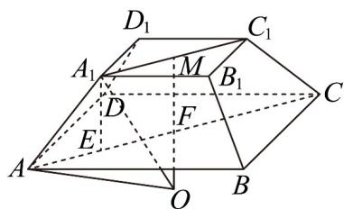

> [!faq]- 《第八章 立体几何初步（高效培优单元自测·提升卷）》官方解析
>
> > [!success]- **【答案】** A. $\frac{28\pi}{3}$ B. $\frac{112\pi}{3}$ C. $\frac{28\pi}{9}$ D. $\frac{112\pi}{9}$
>
> > [!note]- **【分析】**
> > 取 $AC, A_{1}C_{1}$ 中点分别为 F, M，连接 MF，过 $A_{1}$ 作平面 ABCD 的垂线，垂足为 E，设正四棱台 $ABCD - A_{1}B_{1}C_{1}D_{1}$ 外接球的球心为 O，半径为 R，则 O 在直线 MF 上，又 $OA_{1} = OA = R$ ，利用勾股定理求出
> >
> > OF 即可求出 $R^{2}$ 从而得解·
>
> > [!note]- **【解析】**
> > 正四棱台 $ABCD - A_{1}B_{1}C_{1}D_{1}$ 中，取 $AC, A_{1}C_{1}$ 中点分别为 $F, M$ ，连接 $MF$
> >
> > 
> >
> > 由 $A_{1}B_{1} = 2\sqrt{2}$ ， $AB = 3\sqrt{2}$ ， $AA_{1} = 2$ ，可得 $AF = \frac{1}{2}\sqrt{\left(3\sqrt{2}\right)^{2} + \left(3\sqrt{2}\right)^{2}} = 3$ ， $A_{1}M = \frac{1}{2}\sqrt{\left(2\sqrt{2}\right)^{2} + \left(2\sqrt{2}\right)^{2}} = 2$
> >
> > 过 $A_{1}$ 作平面ABCD的垂线，垂足为 $E$ ，则点 $E$ 在 $AC$ 上，且 $AE = AF - A_{1}M = 1$
> >
> > 所以 $A_{1}E = \sqrt{AA_{1}^{2} - AE^{2}} = \sqrt{3}$
> >
> > 设正四棱台 $ABCD - A_{1}B_{1}C_{1}D_{1}$ 外接球的球心为 O，半径为 R，
> >
> > 由对称性可知球心在直线 MF 上，
> >
> > 若球心在线段 $MF$ 上，则 $R^2 = OF^2 + AF^2 = (FM - OF)^2 + A_1M^2$ ，此时 $OF$ 无正数解，
> >
> > 所以球心在 $MF$ 的延长线上，则 $R^2 = OF^2 + AF^2 = (OF + FM)^2 + A_1M^2$
> >
> > 即 $OF^{2}+3^{2}=\left(OF+\sqrt{3}\right)^{2}+2^{2}$ ，解得 $OF=\frac{\sqrt{3}}{3}$
> >
> > 所以 $R^2 = OF^2 +AF^2 = \frac{28}{3}$
> >
> > 所以该外接球的表面积为 $4\pi R^{2} = \frac{112\pi}{3}$
> >
> > 故选 **B**
