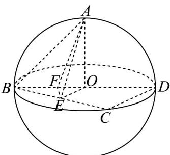

> [!faq]- 《第八章 立体几何初步（高效培优单元自测·提升卷）》官方解析
>
> > [!success]- **【答案】** ACD
>
> > [!note]- **【分析】**
> > 设球 O 的半径为 r，求得 $r = \sqrt{3}$ ，证得 $BC \perp$ 平面 AOE，得到 $BC \perp AE$ ，得到 $\angle AEO = \frac{\pi}{3}$ ，进而
> >
> > 得到 $AE = 2, OE = 1$ ，把异面直线 $AE$ 和 $CD$ 所成角转化为直线 $AE$ 和 $OE$ 所成角，可判定 $\mathsf{A}$ 正确；作
> >
> > $EF \perp BD$ ，证得 $EF \perp$ 平面 ABD，得到 $\angle EAF$ 即为直线 EA 与平面 ABD 所成角，可判定 B 不正确；在直角
> >
> > $\sin \angle ABE = \frac{2}{\sqrt{6}}$ ，结合二倍角公式，可得判定C正确；结合面积公式，可判定D正确·
>
> > [!note]- **【解析】**
> > 
> >
> > 设球 $O$ 的半径为 $r$ ，因为球的表面积为 $12\pi$ ，可得 $4\pi r^2 = 12\pi$ ，可得 $r = \sqrt{3}$
> >
> > 因为 O 和 E 分别为 BD, BC 的中点，所以 $OE \parallel CD$ ，所以 $OE \perp BC$ ，
> >
> > 又因为 $OA \perp$ 平面 BCD ， $BC \subset$ 平面 BCD ，所以 $BC \perp OA$
> >
> > 因为 $OA \cap OE = O$ ，且 $OA, OE \subset$ 平面 AOE，所以 $BC \perp$ 平面 AOE，
> >
> > 又因为 $AE \subset$ 平面 AOE ，所以 $BC \perp AE$
> >
> > 所以 $\angle AEO$ 为二面角 $A - BC - D$ 的平面角，所以 $\angle AEO = \frac{\pi}{3}$
> >
> > 在直角 $\triangle AOE$ 中，可得 $AE = \frac{AO}{\sin\angle AEO} = 2, OE = \frac{AO}{\tan\angle AEO} = 1$
> >
> > 对于 A，由 OE // CD，可得异面直线 AE 和 CD 所成角，即为直线 AE 和 OE 所成角，
> >
> > 因为 $\angle AEO = \frac{\pi}{3}$ ，所以异面直线 $AE$ 和 $CD$ 所成角的大小为 $\frac{\pi}{3}$ ，所以A正确；
> >
> > 对于 $^{B}$ ，过点E作 $EF\perp BD$ ，垂足为F，
> >
> > 因为 $OA \perp$ 平面 BCD ， $EF \subset$ 平面 BCD ，所以 $EF \perp OA$
> >
> > 又因为 $OA \cap BD = O$ ，且 $OA, BD \subset$ 平面 ABD，所以 $EF \perp$ 平面 ABD，
> >
> > 所以 $\angle EAF$ 即为直线 $EA$ 与平面 $ABD$ 所成角，
> >
> > 在直角 $\triangle BOE$ 中， $OB = \sqrt{3}, OE = 1$ ，可得 $BE = \sqrt{2}$ ，则 $EF = \frac{OE \cdot BE}{OB} = \frac{\sqrt{2}}{\sqrt{3}}$
> >
> > 所以 $\sin\angle EAF=\frac{EF}{AE}=\frac{\sqrt{6}}{6}$ ，所以 B 不正确；
> >
> > 对于 $C$ ，在直角 $\triangle ABE$ 中， $AE = 2, BE = \sqrt{2}$ ，可得 $AB = \sqrt{AE^2 + BE^2} = \sqrt{6}$
> >
> > 所以 $\sin \angle ABE = \frac{AE}{AB} = \frac{2}{\sqrt{6}}$ ，则 $\cos \angle ABE = \sqrt{1 - \sin^2\angle ABE} = \frac{\sqrt{2}}{\sqrt{6}}$
> >
> > 所以 $\sin(2\angle ABE)=2\sin\angle ABE\cos\angle ABE=2\times\frac{2}{\sqrt{6}}\times\frac{\sqrt{2}}{\sqrt{6}}=\frac{2\sqrt{2}}{3}$ ，所以 C 正确；
> >
> > 对于 D，由 $\triangle BED$ 的面积为 $S = \frac{1}{2} BD \cdot EF = \frac{1}{2} \times 2\sqrt{3} \times \frac{\sqrt{2}}{\sqrt{3}} = \sqrt{2}$ ，所以 D 正确.
> >
> > 故选 **ACD**.
