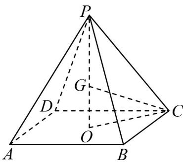

> [!faq]- 《第八章 立体几何初步（高效培优单元自测·提升卷）》官方解析
>
> > [!success]- **【答案】** A. $h$ 的取值范围是 $(0,1)$ B. 若正四棱锥 $P - ABCD$ 的侧棱长为 $\frac{\sqrt{3}}{2}$ ，则 $h = \frac{\sqrt{2}}{2}$ C. 当点 $P$ 为正方体 $ABCD - A_{1}B_{1}C_{1}D_{1}$ 的上底面 $A_{1}B_{1}C_{1}D_{1}$ 的中心时，正四棱锥 $P - ABCD$ 外接球的表面积为 $\frac{9\pi}{4}$ D. 当点 $P$ 为正方体 $ABCD - A_{1}B_{1}C_{1}D_{1}$ 的内切球球心时，正方体 $ABCD - A_{1}B_{1}C_{1}D_{1}$ 的内切球与正四棱锥 $P - ABCD$ 的公共部分的体积为 $\frac{\pi}{36}$
>
> > [!note]- **【分析】**
> > 设正方形 $ABCD$ 和正方形 $A_{1}B_{1}C_{1}D_{1}$ 的中心分别为 $O, O_{1}$ ，当 $P$ 在线段 $OO_{1}$ （不含端点 $O$ ）上，即可判断 ${}^{\mathrm{A}}$ ；根据勾股定理即可判断 ${}^{\mathrm{B}}$ ；设正四棱锥 $P - ABCD$ 的外接球球心为 $G$ ，半径为 $R$ ，则点 $G$ 在 $OP$ 上连接 $CG$ ，根据勾股定理求得 $R$ ，由球的表面积公式即可判断 ${}^{\mathrm{C}}$ ；当 $P$ 为正方体 $ABCD - A_{1}B_{1}C_{1}D_{1}$ 的内切球球心时，此时正方体 $ABCD - A_{1}B_{1}C_{1}D_{1}$ 被分割为 6 个与四棱锥 $P - ABCD$ 相同的四棱锥，正方体 $ABCD - A_{1}B_{1}C_{1}D_{1}$ 的内切球与正四棱锥 $P - ABCD$ 的公共部分的体积为内切球体积的 $\frac{1}{6}$ ，根据球体积公式即
> >
> > 可判断 D.
>
> > [!note]- **【解析】**
> > 对于 A，设正方形 ABCD 和正方形 $A_{1}B_{1}C_{1}D_{1}$ 的中心分别为 $O,O_{1}$
> >
> > 因为正四棱锥 P-ABCD 的底面边长为 1，高为 h，
> >
> > 该正四棱锥的顶点 P 在正方体 $ABCD - A_{1}B_{1}C_{1}D_{1}$ 的内部（包括表面），
> >
> > 所以当 P 在线段 $OO_{1}$ （不含端点 O）上，此时 $h \in (0,1]$ ，故 A 错误；
> >
> > 对于 $^{B}$ ，如图，在Rt△POC中， $h=PO=\sqrt{PC^{2}-OC^{2}}=\sqrt{\frac{3}{4}-\frac{1}{2}}=\frac{1}{2}$ ，故 $^{B}$ 错误；
> >
> > 对于 C，设正四棱锥 P-ABCD 的外接球球心为 G，半径为 R，则点 G 在 OP 上，连接 CG，
> >
> > 在 Rt△OGC 中， $OG = 1 - R, OC = \frac{\sqrt{2}}{2}, GC = R$
> >
> > 则 $R^2 = (1 - R)^2 + \left(\frac{\sqrt{2}}{2}\right)^2$ ，解得 $R = \frac{3}{4}$
> >
> > 所以正四棱锥 P-ABCD 的外接球表面积 $S=4\pi R^{2}=4\pi\times\frac{9}{16}=\frac{9}{4}\pi$ ，故 C 正确；
> >
> > 对于 D，当 P 为正方体 $ABCD - A_{1}B_{1}C_{1}D_{1}$ 的内切球球心时，
> >
> > 此时正方体 $ABCD-A_{1}B_{1}C_{1}D_{1}$ 被分割为 6 个与四棱锥 P-ABCD 相同的四棱锥，
> >
> > 所以正方体 $ABCD - A_{1}B_{1}C_{1}D_{1}$ 的内切球与正四棱锥 $P - ABCD$ 的公共部分的体积为内切球体积的 $\frac{1}{6}$
> >
> > 所以公共部分的体积为 $\frac{1}{6} \times \frac{4}{3} \pi \times \left( \frac{1}{2} \right)^{3} = \frac{\pi}{36}$ ，故 D 正确；
> >
> > 故选：CD.
> >
> > 
