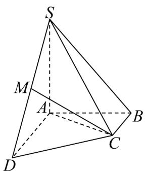

<!-- question-source:start -->
15．（13分）如图，在四棱锥 $S - ABCD$ 中， $SA \perp$ 平面 $ABCD$ ， $AB \perp AD$ ， $AD \parallel BC$ ， $AB = BC = 1$

$AD = AS = 2$ ， $M$ 为 $SD$ 的中点·

(1)求证：MC∥平面SAB；

(2)求证： $CD \perp$ 平面 SAC.
<!-- question-source:end -->

![[高中/课堂同步/题库/人教A版高中数学同步讲义(2026)/02_必修第二册/第八章 立体几何初步/第八章 立体几何初步（高效培优单元自测·提升卷）/三_填空题/questions/answers/Q00069921A1.md]]
