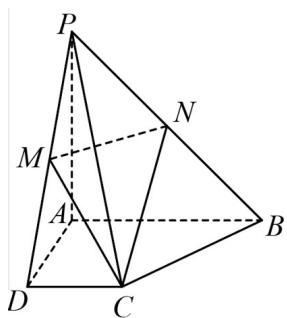

<!-- question-source:start -->
17．（15分）如图，在四棱锥 $P - ABCD$ 中，底面 $ABCD$ 是直角梯形， $\angle BAD = \angle CDA = 90^{\circ}$ ， $PA\bot$ 平面

ABCD，PA = AD = AB = 2，CD = 1，M，N分别是PD，PB的中点.

(1)证明：直线 $NC \parallel$ 平面 $PAD$ ；

(2)求平面 $PDC$ 与底面 $ABCD$ 所成的锐二面角的余弦值.
<!-- question-source:end -->

![[高中/课堂同步/题库/人教A版高中数学同步讲义(2026)/02_必修第二册/第八章 立体几何初步/第八章 立体几何初步（高效培优单元自测·提升卷）/三_填空题/questions/answers/Q00069923A1.md]]
