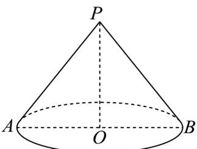

> [!faq]- 《第八章 立体几何初步（高效培优单元自测·提升卷）》官方解析
>
> > [!success]- **【答案】** $\frac{\sqrt{3}\pi}{3}$
>
> > [!note]- **【分析】**
> > 由已知得到该圆锥的母线长，利用勾股定理可得圆锥的高，再由体积公式可得答案.
>
> > [!note]- **【解析】**
> > 如图底面半径为 AO=1 的圆锥中，
> >
> > 
> >
> > 侧面积为 $S_{\text{侧}} = \pi rl = \pi \cdot AO \cdot PA = 2\pi$
> >
> > 所以 $PA = 2$ ，由勾股定理得 $PO = \sqrt{PA^2 - AO^2} = \sqrt{4 - 1} = \sqrt{3}$
> >
> > 所以该圆锥的体积 $V=\frac{1}{3}\pi AO^{2}\cdot PO=\frac{\sqrt{3}\pi}{3}$
> >
> > 故答案为： $\frac{\sqrt{3}\pi}{3}$
