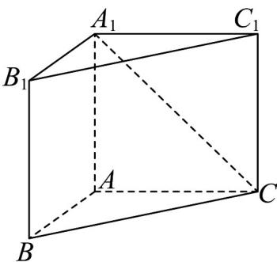
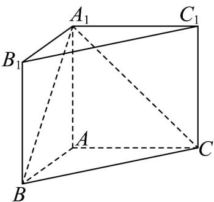

> [!faq]- 《第八章 立体几何初步（高效培优单元自测·提升卷）》官方解析
>
> > [!success]- **【答案】** 
>
> > [!note]- **【分析】**
> > 根据异面直线所成角的定义求解即可·
>
> > [!note]- **【解析】**
> > 如图，连接 $A_{1}B$
> >
> > 
> >
> > 直三棱柱 $ABC-A_{1}B_{1}C_{1}$ 中， $B_{1}C_{1}//BC$ ， $AA_{1}\perp AC,AA_{1}\perp AB$
> >
> > 所以异面直线 $A_{1}C$ 与 $B_{1}C_{1}$ 所成角为 $\angle A_{1}CB$
> >
> > 因为 $AB = AC = AA_{1}$ ， $AB\perp AC$ ，易得 $A_{1}B = BC = A_{1}C$
> >
> > 所以 $\triangle A_{1}BC$ 为等边三角形，所以 $\angle A_{1}CB = 60^{\circ}$
> >
> > 故答案为： $60^{\circ}$
