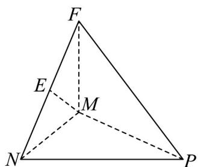

> [!faq]- 《第八章 立体几何初步（高效培优单元自测·提升卷）》官方解析
>
> > [!success]- **【答案】** $9\pi$
>
> > [!note]- **【分析】**
> > 过 M 作 $ME \perp NF$ 于 E，由题意可证明 $NP \perp MN$ ，结合已知可得 $NP \cdot MN = 4$ ，进而得 FP 是三棱
> >
> > 锥 $F - MNP$ 外接球的直径，利用 $FP^2 = 1 + MN^2 + NP^2$ ，结合重要不等式可求三棱锥 $F - MNP$ 外接球表面积
> >
> > 的最小值·
>
> > [!note]- **【解析】**
> > 过M作 $ME \perp NF$ 于E，
> >
> > 因为侧面 $FMN \perp$ 侧面 FNP ，又侧面 $FMN \cap$ 侧面 FNP = FN ，
> >
> > 所以 $ME \perp$ 侧面 FNP，又 $NP \subset$ 侧面 FNP，
> >
> > 所以 $ME \perp NP$ ，又因为 $FM \perp$ 底面 MNP， $NP \subset$ 底面 MNP，
> >
> > 所以 $FM \perp NP$ ，又 $ME \cap MF = M$ ， $ME, MF \subset$ 侧面 FMN，
> >
> > 所以 $NP \perp$ 平面 FMN ，又因为 $MN \subset$ 平面 FMN ，所以 $NP \perp MN$
> >
> > 因为底面 $\triangle MNP$ 的面积为 $2$ ，可得 $\frac{1}{2} NP\cdot MN = 2$ ，所以 $NP\cdot MN = 4$
> >
> > 由题意可得 $\triangle FNP$ 和 $\triangle FMP$ 是共用斜边 FP 的直角三角形，
> >
> > 所以 FP 是三棱锥 F - MNP 外接球的直径，
> >
> > 所以 $FP^{2} = FM^{2} + MP^{2} = 1 + MN^{2} + NP^{2} \quad 1 + 2MN \cdot NP = 9$
> >
> > 当且仅当 MN = NP = 2 时取等号。
> >
> > 所以 $FP = 3$ ，所以 $\frac{1}{2} FP = \frac{3}{2}$ ，即三棱锥 $F - MNP$ 外接球的半径的最小值为 $\frac{3}{2}$ ，
> >
> > 所以三棱锥 F-MNP 外接球表面积的最小值为 $4\pi\left(\frac{3}{2}\right)^{2}=9\pi$
> >
> > 故答案为： $9\pi$
> >
> > 
> >
> > 四、解答题：本题共5小题，共77分。解答应写出文字说明、证明过程或演算步骤。
