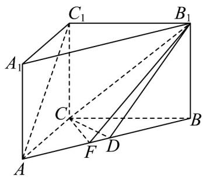

> [!faq]- 《第八章 立体几何初步（高效培优单元自测·提升卷）》官方解析
>
> > [!success]- **【答案】** $^{(1)}$ 证明见解析 $^{(2)}$ $\frac{12}{25}$
>
> > [!note]- **【分析】**
> > （1）根据三棱柱的性质，结合已知条件由线面垂直推出面面垂直；
> >
> > (2) 根据三棱柱的几何性质，结合已知条件求出直线 $CB_{1}$ 与平面 $ABB_{1}A_{1}$ 所成角，进而求出正弦值.
>
> > [!note]- **【解析】**
> > （1）∵ $AA_{1} \perp$ 平面 ABC， $CD \subset$ 平面 ABC，
> >
> > $\therefore AA_{1} \perp CD$ ，又 $\because CD \perp AB$ ， $AA_{1} \cap AB = A$ ， $AA_{1}$ 、 $AB \subset$ 平面 $ABB_{1}A_{1}$
> >
> > $\backslash CD^{\wedge}$ 平面 $ABB_{1}A_{1}$
> >
> > $\because CD \subset_{\text{平面}} CDB_{1}$
> >
> > ∴ 平面 $ABB_{1}A_{1} \perp$ 平面 $CDB_{1}$
> >
> > (2)
> >
> > 
> >
> > 过点 C 作 $CF \perp AB$ 于 F ，连接 $FB_{1}$
> >
> > $\because AA_{1} \perp$ 平面 $ABC, CF \subset$ 平面 $ABC, \therefore AA_{1} \perp CF$
> >
> > 又∵ $CF \perp AB$ ， $AA_{1} \cap AB = A$ ， $AA_{1}$ 、 $AB \subset$ 平面 $ABB_{1}A_{1}$ ，∴ $CF \perp$ 平面 $ABB_{1}A_{1}$ ，
> >
> > 故 $\angle CB_{1}F$ 就是直线 $CB_{1}$ 与平面 $ABB_{1}A_{1}$ 所成的角，
> >
> > $\therefore \left|AB\right| = 5\quad \left|AC\right| = 3\quad \left|BC\right| = 4\quad \therefore \left|AC\right|^2 +\left|BC\right|^2 = \left|AB\right|^2$
> >
> > 故VABC是以角C为直角的三角形，
> >
> > 又∵ $CF \perp AB$ ，由 $\frac{1}{2}|AC|\cdot|BC|=\frac{1}{2}|CF|\cdot|AB|$ ，可得 $|CF|=\frac{3\times4}{5}=\frac{12}{5}$ 。
> >
> > 又∵ $\left|BB_{1}\right|=\left|AA_{1}\right|=3,\quad\left|CB_{1}\right|=\sqrt{\left|BB_{1}\right|^{2}+\left|CB\right|^{2}}=\sqrt{4^{2}+3^{2}}=5$
> >
> > $\sin \angle CB_{1}F = \frac{|CF|}{|CB_{1}|} = \frac{12}{25}$
> >
> > ∴ 直线 $CB_{1}$ 与平面 $ABB_{1}A_{1}$ 所成角的正弦值为 $\frac{12}{25}$
