<!-- source-part:1 pages:1-50 -->

## 第八章 立体几何初步

## 教学目标、教学重难点

<table><tr><td>教学目标</td><td>1. 掌握空间几何体的核心特征:能识别柱、锥、台、球及简单组合体的结构本质(如棱柱“有两个面平行且其余各面为平行四边形”),区分多面体与旋转体的构成差异;能运用结构特征描述现实生活中物体的几何形态(如建筑、家具的几何体抽象)。2. 熟练运用空间图形的表示方法:掌握三视图(正视图、侧视图、俯视图)的绘制与识别,能实现立体模型与三视图的双向转化;学会用斜二侧画法规范绘制直观图,理解平行投影与中心投影的区别与应用场景。3. 理解空间基本要素的位置关系:以长方体为载体,抽象出点、线、面的定义,掌握平面基本性质(三大公理)及推论;明确空间直线的三种位置关系(平行、相交、异面),熟练运用线面平行、垂直、面面平行、垂直的判定定理与性质定理,能进行简单命题的论证。4. 掌握核心度量计算方法:了解柱、锥、台、球的表面积与体积计算公式(侧重理解推导逻辑,不强制记忆),能结合三视图或直观图计算简单几何体的度量值;初步学会运用空间几何知识解决实际度量问题(如容器容积、建筑用料估算)。5. 构建几何语言体系:能准确运用文字语言、图形语言、符号语言描述空间关系,实现三种语言的灵活转化,规范书写几何推理过程。</td></tr><tr><td>教学重难点</td><td>重点1. 掌握空间几何体的核心特征:能识别柱、锥、台、球及简单组合体的结构本质(如棱柱“有两个面平行且其余各面为平行四边形”),区分多面体与旋转体的构成差异;能运用结构特征描述现实生活中物体的几何形态(如建筑、家具的几何体抽象)。2. 熟练运用空间图形的表示方法:掌握三视图(正视图、侧视图、俯视图)的绘制与识别,能实现立体模型与三视图的双向转化;学会用斜二侧画法规范绘制直观图,理解平行投影与中心投影的区别与应用场景。3. 理解空间基本要素的位置关系:以长方体为载体,抽象出点、线、面的定义,掌握平面基本性质(三大公理)及推论;明确空间直线的三种位置关系(平行、相交、异面),熟练运用线面平行、垂直、面面平行、垂直的判定定理与性质定理,能进行简单命题的论证。4. 掌握核心度量计算方法:了解柱、锥、台、球的表面积约与体积计算公式(侧重理解推导逻辑,不强制记忆),能结合三视图或直观图计算简单几何体的度量值;初步学会运用空间几何知识解决实际度量问题(如容器容积、建筑用料估算)。5.构建几何语言体系:能准确运用文字语言、图形语言、符号语言描述空间关系,实现三种语言的灵活转化,规范书写几何推理过程。难点1.空间想象能力的建立:难点在于突破平面思维局限,理解平面的“无限延展性”(易将实物平面等同于数学平面),能在脑海中构建复杂几何体的三维结构,准确把握空间元素的相对位置关系。2.异面直线概念的理解与判定:学生易将异面直线与平行、相交直线混淆,难以直观感知“既不平行也不相交”的空间特征,需通过动态演示与实物观察突破认知障碍。3.几何定理的灵活应用与推理规范:线面、面面平行与垂直的判定定理和性质定理易混淆,难以准确选择定理进行推理;几何语言的规范表达(尤其是符号语言与图形语言的对应)是易错点,需强化推理步骤的逻辑性与严谨性。4.图形转化与模型构建:难点在于将实际问题抽象为空间几何模型,如将建筑结构转化为柱、锥组合体;在三视图还原立体图形时,易出现维度缺失或结构偏差,需通过大量变式训练提升转化能力。5.公理体系的抽象理解:对平面基本性质的公理化特征认识不足,难以运用公理解决抽象的共面、共线问题,需通过具象化演示(如三脚架定面、纸面相交)帮助内化本</td></tr></table>

## 知识清单

## 知识点 01 简单凸多面体—棱柱、棱锥、棱台

1. 棱柱：两个面互相平面，其余各面都是四边形，并且每相邻两个四边形的公共边都互相平行，由这些面所

围成的多面体叫做棱柱．

(1) 斜棱柱：侧棱不垂直于底面的棱柱；

(2) 直棱柱：侧棱垂直于底面的棱柱；

(3) 正棱柱：底面是正多边形的直棱柱；

(4) 平行六面体：底面是平行四边形的棱柱；

(5) 直平行六面体：侧棱垂直于底面的平行六面体；

(6) 长方体：底面是矩形的直平行六面体；

(7) 正方体：棱长都相等的长方体。

2.棱锥：有一个面是多边形，其余各面是有一个公共顶点的三角形，由这些面所围成的多面体叫做棱锥.

(1) 正棱锥：底面是正多边形，且顶点在底面的射影是底面的中心；

(2) 正四面体：所有棱长都相等的三棱锥。

3.棱台：用一个平行于棱锥底面的平面去截棱锥，底面和截面之间的部分叫做棱台，由正棱锥截得的棱台叫

简单凸多面体的分类及其之间的关系如图所示.

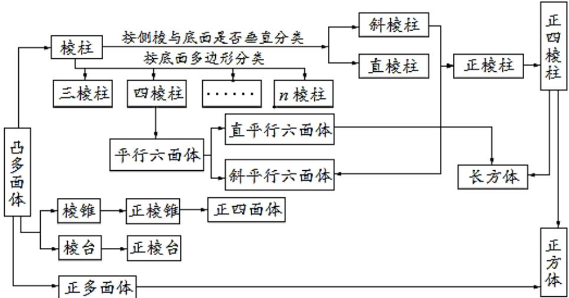

## 【即学即练】

1. 如图所示，在三棱台 $ABC - A_{1}B_{1}C_{1}$ 中，截去三棱锥 $A_{1} - ABC$ ，则剩余部分是（）

【答案】

A.四棱台 B.四棱锥C.三棱台 D.三棱锥

【答案】B

【分析】根据四棱锥的概念进行判断·

【详解】由图可知：三棱台 $ABC - A_{1}B_{1}C_{1}$ 中，截去三棱锥 $A_{1} - ABC$

则剩余部分是以 $A_{1}$ 为顶点，以四边形 $BCC_{1}B_{1}$ 为底面的四棱锥.

故选：B

2. 北京大兴国际机场的显著特点之一是各种弯曲空间的运用。刻画空间的弯曲性是几何研究的重要内容。用

曲率刻画空间弯曲性，规定：多面体顶点的曲率等于 $2\pi$ 与多面体在该点的面角之和的差（多面体的面的内角

叫做多面体的面角，角度用弧度制），多面体面上非顶点的曲率均为零，多面体的总曲率等于该多面体各顶

点的曲率之和，例如：正四面体在每个顶点有 $^{3}$ 个面角，每个面角是 $^{3}$ ，所以正四面体在各顶点的曲率为

$2\pi-3\times\frac{\pi}{3}=\pi$ ，故其总曲率为 $4\pi$ ，则五棱锥的总曲率为\_\_\_\_。

【答案】 $4\pi$

【分析】由题意可知，五棱锥的总曲率等于五棱锥各顶点的曲率之和，可以从整个多面体的角度考虑，所有

顶点相关的面角就是多面体的所有多边形表面的内角的集合，

【详解】由图可知五棱锥有6个顶点，6个面，其中5个三角形，1个五边形，

所以五棱锥的表面内角和由 $^{5}$ 个为三角形， $^{1}$ 个为五边形组成，

所以面角和为 $5\pi + 3\pi = 8\pi$ ，故总曲率为 $6 \times 2\pi - 8\pi = 4\pi$ 。

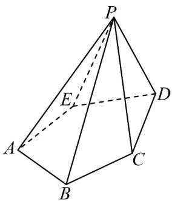

故答案为： $4\pi$ ：

## 知识点 02 简单旋转体—圆柱、圆锥、圆台、球

表面积与体积计算公式

表面积公式

<table><tr><td rowspan="3">表面积</td><td>柱体</td><td> $S_{\text{直棱柱}} = ch + 2S_{\text{底}}$  $S_{\text{斜棱柱}} = c'l + 2S_{\text{底}} (c'$ 为直截面周长)  $S_{\text{圆锥}} = 2\pi r^{2} + 2\pi rl = 2\pi r(r+l)$ </td><td></td></tr><tr><td>锥体</td><td> $S_{\text{正棱锥}} = \frac{1}{2} nah' + S_{\text{底}}$  $S_{\text{圆锥}} = \pi r^{2} + \pi rl = \pi r(r+l)$ </td><td>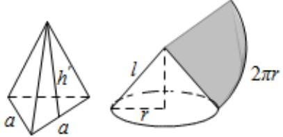</td></tr><tr><td>台体球</td><td> $S_{\text{正棱台}} = \frac{1}{2} n(a+a')h + S_{\text{上}} + S_{\text{下}}$  $S_{\text{圆台}} = \pi (r'^{2} + r^{2} + r'l + rl)$  $S = 4\pi R^{2}$ </td><td>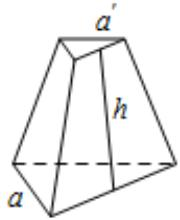 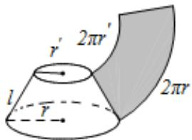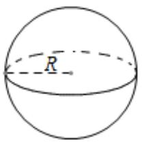</td></tr></table>

## 体积公式

<table><tr><td rowspan="4">体积</td><td>柱体</td><td> $V_{\text{柱}} = Sh$ </td><td></td></tr><tr><td>锥体</td><td> $V_{\text{锥}} = \frac{1}{3}Sh$ </td><td>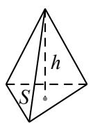</td></tr><tr><td>台体</td><td> $V_{\text{台}} = \frac{1}{3}(S + \sqrt{SS'} + S')h$ </td><td>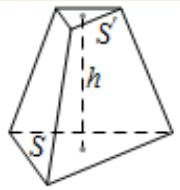</td></tr><tr><td>球</td><td> $V = \frac{4}{3}\pi R^3$ </td><td>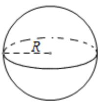</td></tr></table>

## 【即学即练】

1. 如图，圆柱高 $8\mathrm{cm}$ ，底面半径 $2\mathrm{cm}$ ，一只蚂蚁从点 $A$ 爬到点 $B$ 处吃食，要爬行的最短路程为（）（π取
3）

A. $10\mathrm{cm}$ B. $14\mathrm{cm}$ C. $20\mathrm{cm}$ D.无法确定

【答案】A

【分析】利用侧面展开图，结合勾股定理即可求解最短路径长·

【详解】

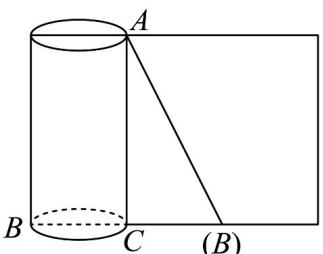

通过圆柱侧面展开图，可知最短路径为侧面展开图中的直角三角形 $\forall ABC$ 的斜边，即 $AB = \sqrt{(2\pi)^2 + 64} \approx \sqrt{36 + 64} = 10(\mathrm{cm})$

故选：A.

2. 用平面截一个几何体，如果所得截面是矩形，那么该几何体可能是（）

【答案】
A. 圆柱    B. 圆锥    C. 三棱柱    D. 四棱锥

【答案】ACD

【分析】根据圆柱、圆锥、棱柱、棱锥的几何性质逐一验证即可得出结论·

【详解】对于 $^{A}$ ，过圆柱旋转轴的截面截圆柱所得截面为矩形，因此 $^{A}$ 正确；

对于 $^{B}$ ，截圆锥所得平面可以是三角形和曲边图形，不可能是矩形，即 $^{B}$ 错误；

对于 $C$ ，在直三棱柱中，用平行于某一侧面的截面截三棱柱所得的截面可以为矩形，即 $C$ 正确；

对于 $^{D}$ ，在正四棱锥中，用平行于底面的截面截四棱锥可以得到矩形截面，即 $^{D}$ 正确·

故选：ACD

## 知识点 03 空间几何体的直观图

1. 斜二测画法

斜二测画法的主要步骤如下：

(1) 建立直角坐标系．在已知水平放置的平面图形中取互相垂直的 $Ox$ ， $Oy$ ，建立直角坐标系．

(2) 画出斜坐标系．在画直观图的纸上（平面上）画出对应图形．在已知图形平行于 $x$ 轴的线段，在直观图

中画成平行于 $O^{\prime}x^{\prime}$ ， $O^{\prime}y^{\prime}$ ，使 $\angle x^{\prime}O^{\prime}y^{\prime} = 45^{\circ}$ （或 $135^{\circ}$ ），它们确定的平面表示水平平面.

(3) 画出对应图形．在已知图形平行于 $x$ 轴的线段，在直观图中画成平行于 $x'$ 轴的线段，且长度保持不变；

在已知图形平行于 $y$ 轴的线段，在直观图中画成平行于 $y'$ 轴，且长度变为原来的一般。可简化为“横不变，纵

减半”.

(4) 擦去辅助线．图画好后，要擦去 $x'$ 轴、 $y'$ 轴及为画图添加的辅助线（虚线）．被挡住的棱画虚线．

注：直观图和平面图形的面积比为 $\sqrt{2}:4$ .

2. 平行投影与中心投影

平行投影的投影线是互相平行的，中心投影的投影线相交于一点。

【即学即练】

1. 如图，正方形 $O'A'B'C'$ 的边长为 1，它是按“斜二测画法”得到的一个水平放置的平面图形 $OABC$ 的直观图，则它的原图形 $OABC$ 的周长是（）

【答案】

A. 4 B. 6 C. $2 + 2\sqrt{2}$ D. 8

【答案】D
【分析】将直观图还原为平面图形是平行四边形，然后计算。
【详解】将直观图还原为平面图形，如图所示 $OB = 2O'B' = 2\sqrt{2}$ ， $OA = O'A' = 1$ ，所以 $AB = \sqrt{1^2 + (2\sqrt{2})^2} = 3$

所以原图形的周长为 $8cm$

故选：D.

2. 如图， $\triangle A'B'O'$ 是利用斜二测画法画出的 Rt $\triangle ABO$ （ $\angle ABO$ 为直角）的直观图，Rt $\triangle ABO$ 的面积为 16

图中 $O'B' = 4$ ，过点 $A'$ 作 $A'C' \perp x'$ 轴于点 $C'$ ，则 $A'C'$ 的长为（）

A. 1 B. $\sqrt{2}$ C. $2\sqrt{2}$ D. $4\sqrt{2}$

【答案】C

【分析】利用面积公式求出原 $\triangle ABO$ 的高 AB，进而求出 $A'B'$ ，然后在 $Rt\triangle A'B'C'$ 中求解即可.

【详解】在 $\triangle ABO$ 中， $\angle ABO = \frac{\pi}{2}$ ，由 $\triangle ABO$ 的面积为 16， $OB = O'B' = 4$

得 $\frac{1}{2} AB\cdot OB = 16$ ，则 $AB = 8$ ， $A^{\prime}B^{\prime} = 4$ ，而 $\angle A'B'C' = \frac{\pi}{4}$ ， $A^{\prime}C^{\prime}\perp x^{\prime}$ 轴于点 $C^\prime$

所以 $A^{\prime}C^{\prime}=A^{\prime}B^{\prime}\cdot\sin\frac{\pi}{4}=4\times\frac{\sqrt{2}}{2}=2\sqrt{2}$

故选：C

知识点 04 四个公理

公理 $^{1}$ ：如果一条直线上的两点在一个平面内，那么这条直线在此平面内。

注意：（1）此公理是判定直线在平面内的依据；（2）此公理是判定点在面内的方法

公理 $^{2}$ ：过不在一条直线上的三点，有且只有一个平面．

注意：（1）此公理是确定一个平面的依据；（2）此公理是判定若干点共面的依据

推论①：经过一条直线和这条直线外一点，有且只有一个平面；

注意：（1）此推论是判定若干条直线共面的依据

(2) 此推论是判定若干平面重合的依据

(3) 此推论是判定几何图形是平面图形的依据

推论②：经过两条相交直线，有且只有一个平面；

推论③：经过两条平行直线，有且只有一个平面；

公理 $^{3}$ ：如果两个不重合的平面有一个公共点，那么它们有且只有一条过该点的公共直线。

注意：（1）此公理是判定两个平面相交的依据

(2) 此公理是判定若干点在两个相交平面的交线上的依据（比如证明三点共线、三线共点）

(3) 此推论是判定几何图形是平面图形的依据

公理 $^{4}$ ：平行于同一条直线的两条直线互相平行。

## 【即学即练】

1. 下列说法正确的是（）

【答案】
A．三点确定一个平面    B．用一个平面截圆锥，必得到一个圆锥和一个圆台
C．一个棱柱至少有两个面互相平行    D．四边形一定是平面图形

【答案】C

【分析】由基本事实一可判断 $^{A}$ ；由空间几何体的结构特征可判断 BCD.

【详解】对于 $^{A}$ ，由基本事实一可知，不共线的三点可以确定一个平面，故 $^{A}$ 错误；

对于 $^{B}$ ，用平行于底面的平面截圆锥，可得到一个圆锥和一个圆台，故 $^{B}$ 错误；

对于 $C$ ，由棱柱的性质可知，任意棱柱上底面与下底面平行，故 $C$ 正确；

对于 $^{D}$ ，在空间中，不共面的四点构成的四边形是空间四边形，故 $^{D}$ 错误·

故选：C

2. 已知 $a, b, c$ 是空间中的三条直线，且 $a \perp b$ ，则“ $b \perp c$ ”是“ $a // c$ ”的（）

【答案】

A. 充分不必要条件

B. 必要不充分条件

C. 充要条件

D. 既不充分也不必要条

件

【答案】B

【分析】根据空间中垂直和平行的性质及充分条件、必要条件、充要条件的定义分析判断即可·

【详解】若 $a \perp b$ ， $b \perp c$ ，则 $a$ ， $c$ 可以异面、平行或相交，故由 $b \perp c$ 推不出 $a // c$ ，

若 $a \perp b$ ，a // c，根据平行线的性质，则 $b \perp c$ ，

所以“ $b \perp c$ ”是“ $a // c$ ”的必要不充分条件.

故选：B.

知识点 05 直线与直线的位置关系

<table><tr><td>位置关系</td><td>相交(共面)</td><td>平行(共面)</td><td>异面</td></tr><tr><td>图形</td><td></td><td></td><td>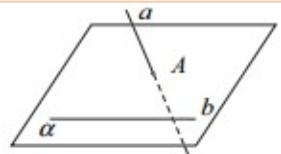</td></tr><tr><td>符号</td><td>a∩b=P</td><td>a||b</td><td>a∩α=A,b⊂α,A∉b</td></tr><tr><td>公共点个数</td><td>1</td><td>0</td><td>0</td></tr><tr><td>特征</td><td>两条相交直线确定一个平面</td><td>两条平行直线确定一个平面</td><td>两条异面直线不同在如何一个平面内</td></tr></table>

## 【即学即练】

1. 在棱长为 2 的正方体 $ABCD - A_{1}B_{1}C_{1}D_{1}$ 中，E, F 分别为 AB, AD 的中点，则异面直线 $B_{1}C, EF$ 所成角的余弦值为（）

【答案】

A. $\frac{1}{2}$ B. $\frac{\sqrt{2}}{2}$ C. $\frac{\sqrt{3}}{2}$ D. $\frac{\sqrt{2}}{4}$

【答案】A

【分析】根据异面直线所成角的定义，结合正方体的性质即可求解.
【详解】连接 $EF, BD, B_{1}D_{1}, D_{1}C$

由于 E, F 分别为 AB, AD 的中点，故 $EF \parallel BD$ ，又 $BD \parallel B_{1}D_{1}$ ，因此 $EF \parallel B_{1}D_{1}$ ，
因此 $\angle D_{1}B_{1}C$ 或其补角即为 $B_{1}C, EF$ 所成角，
由于 $D_{1}B_{1}=D_{1}C=B_{1}C$ ，故 $\angle D_{1}B_{1}C=\frac{\pi}{3}$ ，
因此 $\cos\angle D_{1}B_{1}C=\frac{1}{2}$

故选：A

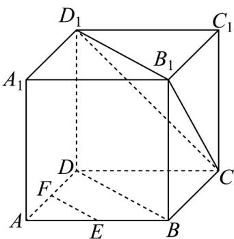

2. 已知空间中的两个角 $\angle ABC$ 和 $\angle A'B'C'$ ，若 $AB // A'B', BC // B'C', \angle ABC = 50^\circ$ ，则 $\angle A'B'C' =$ \_\_\_\_.

【答案】 $50^{\circ}$ 或 $130^{\circ}$

【分析】根据等角定理可得·

【详解】由等角定理可知 $\angle ABC$ 与 $\angle A'B'C'$ 相等或互补，

所以 $\angle A'B'C' = 50^{\circ}$ 或 $\angle A'B'C' = 130^{\circ}$ .

故答案为： $50^{\circ}$ 或 $130^{\circ}$

## 知识点 06 直线与平面的位置关系

有直线在平面内、直线与平面相交、直线与平面平行三种情况。

<table><tr><td>位置关系</td><td>包含(面内线)</td><td>相交(面外线)</td><td>平行(面外线)</td></tr><tr><td>图形</td><td>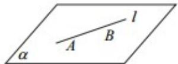</td><td>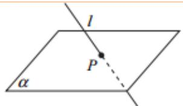</td><td></td></tr><tr><td>符号</td><td> $l \subset \alpha$ </td><td> $l \cap \alpha = P$ </td><td> $l \parallel \alpha$ </td></tr><tr><td>公共点个数</td><td>无数个</td><td>1</td><td>0</td></tr></table>

【即学即练】

1. 如图，正方体 $ABCD - A_{1}B_{1}C_{1}D_{1}, E, F$ 分别是 $AA_{1}, A_{1}B_{1}$ 的中点.

(1)求异面直线 EF 与 $BC_{1}$ 所成角的大小；

(2)证明： $EF \parallel$ 平面 $BC_{1}D$ .

【答案】(1) $\frac{\pi}{3}$

(2)证明见解析

【分析】（ $^{1}$ ）作出异面直线所成的角，利用三角形的边角关系求角·

(2) 根据线面平行的判定定理证明线面平行.

【详解】（1）连接 $AB_{1}$ ，如图：

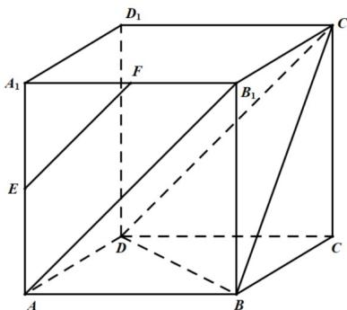

因为 E，F 分别为 $AA_{1}$ ， $A_{1}B_{1}$ 的中点，所以 $EF // AB_{1}$

又 $ABCD - A_{1}B_{1}C_{1}D_{1}$ 为正方体，所以 $AB_{1} / / DC_{1}$

所以 $EF \parallel DC_{1}$ .

所以 $\angle DC_{1}B$ 即为异面直线 EF 与 $BC_{1}$ 所成的角.

又 $\triangle BC_{1}D$ 为等边三角形，所以 $\angle DC_{1}B=\frac{\pi}{3}$

即异面直线 EF 与 $BC_{1}$ 所成角为 $\frac{\pi}{3}$ .

(2) 由 (1) 知： $EF // C_{1}D$ ， $EF \not\subset$ 平面 $BC_{1}D$ ， $C_{1}D \subset$ 平面 $BC_{1}D$

所以 EF // 平面 $BC_{1}D$ .

2. 如图为正四棱台 $ABCD - A_1B_1C_1D_1$ 与正四棱锥 $P - ABCD$ 拼接而成的几何体

证明： $AC \perp$ 平面 $PB_{1}D_{1}$ .

【答案】证明见解析

【分析】记 AC 与 BD 的交点为 O， $A_{1}C_{1}$ 与 $B_{1}D_{1}$ 的交点为 $O_{1}$ ，由正四棱台和正四棱锥结构性质结合线面垂直

的性质定理求证 $AC \perp PO_{1}$ 和 $AC \perp B_{1}D_{1}$ ，再根据线面垂直的判定定理即可得证。

【详解】证明：记 AC 与 BD 的交点为 O， $A_{1}C_{1}$ 与 $B_{1}D_{1}$ 的交点为 $O_{1}$ ，

则由正四棱台和正四棱锥结构性质可得 $PO \perp$ 平面ABCD， $OO_{1} \perp$ 平面ABCD，且 $AC \perp BD$

又 $PO \cap OO_{1} = O$ ，所以 $O, O_{1}, P$ 三点共线，

又因为 $AC \subset$ 平面ABCD，则 $AC \perp PO$ ，即 $AC \perp PO_{1}$

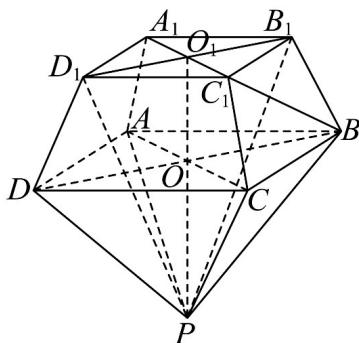

又由正四棱台结构性质可知 $BD // B_{1}D_{1}$ ，所以 $AC \perp B_{1}D_{1}$

因为 $PO_{1} \cap BD = O_{1}$ ， $PO \subset$ 平面 $PB_{1}D_{1}$ ， $B_{1}D_{1} \subset$ 平面 $PB_{1}D_{1}$

故 $AC \perp$ 平面 $PB_{1}D_{1}$ .

## 知识点 07 平面与平面的位置关系

有平行、相交两种情况。

<table><tr><td>位置关系</td><td>平行</td><td>相交(但不垂直)</td><td colspan="2">垂直</td></tr><tr><td>图形</td><td>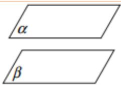</td><td colspan="2"></td><td></td></tr><tr><td>符号</td><td>α∥β</td><td>α∩β=l</td><td colspan="2">α⊥β,α∩β=l</td></tr><tr><td>公共点个数</td><td>0</td><td>无数个公共点且都在唯一的一条直线上</td><td colspan="2">无数个公共点且都在唯一的一条直线上</td></tr></table>

【即学即练】

1．如图，在棱长为 $^{4}$ 的正方体 $ABCD-A_{1}B_{1}C_{1}D_{1}$ 中．点P是棱 $CC_{1}$ 的中点，动点Q在面 $DCC_{1}D_{1}$ 内，包括边

界），若 $AQ \parallel$ 平面 $A_{1}BP$ ，则线段 $AQ$ 长度的取值范围是\_\_\_\_。

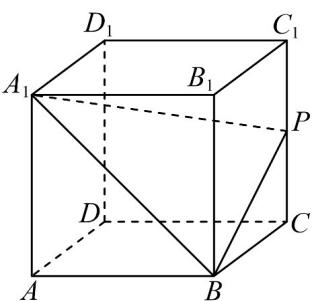

【答案】 $\left[3\sqrt{2}, 2\sqrt{5}\right]$

【分析】通过构造面面平行的方法，判断出 $Q$ 点的轨迹，从而求得 $AQ$ 的取值范围

【详解】设 $Q_{1},Q_{2}$ 分别是 $DD_{1},DC$ 的中点，连接 $AQ_{1},AQ_{2},Q_{1}Q_{2},PQ_{1}$

根据正方体的性质可知 $Q_{1} Q_{2} / / D_{1} C / / A_{1} B$

由于 $D_{1}C \notin$ 平面 $A_{1}BP$ ， $D_{1}C //$ 平面 $A_{1}BP$

所以 $Q_{1}Q_{2} / /$ 平面 $A_{1}BP$

又因 $PQ_{1} // DC // AB, PQ_{1} = DC = AB$ ，可得 $\square ABPQ_{1}$ ，则得 $AQ_{1} // BP$

由于 $AQ_{1} \notin$ 平面 $A_{1}BP$ ， $BP \subset$ 平面 $A_{1}BP$ ，所以 $AQ_{1} //$ 平面 $A_{1}BP$

由于 $AQ_{1} \cap Q_{1}Q_{2} = Q_{1}, AQ_{1}, Q_{1}Q_{2} \subset$ 平面 $AQ_{1}Q_{2}$

所以平面 $AQ_{1}Q_{2} \parallel$ 平面 $A_{1}BP$

因为 $AQ \subset$ 平面 $AQ_{1}Q_{2}$ ，所以 $AQ \parallel$ 平面 $A_{1}BP$ ，

而 $Q \in$ 平面 $DCC_{1}D_{1}$ ， $Q \in$ 平面 $AQ_{1}Q_{2}$ ，平面 $DCC_{1}D_{1} \cap$ 平面 $AQ_{1}Q_{2} = Q_{1}Q_{2}$

故点 $Q$ 的轨迹即线段 $Q_{1}Q_{2}$

$$
A Q _ {1} = A Q _ {2} = \sqrt {4 ^ {2} + 2 ^ {2}} = 2 \sqrt {5}, Q _ {1} Q _ {2} = \sqrt {2 ^ {2} + 2 ^ {2}} = 2 \sqrt {2}
$$

三角形 $AQ_{1}Q_{2}$ 是等腰三角形，底边 $Q_{1}Q_{2}$ 上的高为 $\sqrt{\left(2\sqrt{5}\right)^2 - \left(\frac{2\sqrt{2}}{2}\right)^2} = 3\sqrt{2}$

所以 AQ 的取值范围是 $\left[3\sqrt{2},2\sqrt{5}\right]$ .

故答案为： $[3\sqrt{2}, 2\sqrt{5}]$

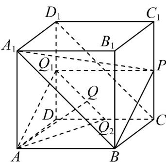

2. 已知 $\alpha$ 、 $\beta$ 是不同的平面， $m$ 为 $\beta$ 内的一条直线，则“ $\alpha \perp \beta$ ”是“ $m \perp \alpha$ ”的（）条件
A. 充分不必要条件 B. 必要不充分条件
C. 充要条件 D. 既不充分也不必要条件

【答案】B

【分析】利用面面垂直的判定定理和性质定理即可作出判断·

【详解】非充分性： $\alpha\perp\beta,m\subset\beta$ 不能推出 $m\perp\alpha$

必要性： $m\perp \alpha ,m\subset \beta \Rightarrow \alpha \perp \beta$

则“ $\alpha\perp\beta$ ”是“ $m\perp\alpha$ ”的必要不充分条件.

故选：B

## 知识点 08 直线和平面平行

判定方法（文字语言、图形语言、符号语言）

<table><tr><td></td><td>文字语言</td><td colspan="2">图形语言</td><td>符号语言</td></tr><tr><td>线∥线⇒线∥面</td><td>如果平面外的一条直线和这个平面内的一条直线平行,那么这条直线和这个平面平行(简记为“线线平行⇒线面平行</td><td colspan="2"></td><td> $\begin{array}{c} l\parallel l_1 \\ l_1 \subset \alpha \\ l \notin \alpha \end{array} \Rightarrow l\parallel \alpha$ </td></tr><tr><td>面∥面⇒线∥面</td><td>如果两个平面平行,那么在一个平面内的所有直线都平行于另一个平面</td><td colspan="2">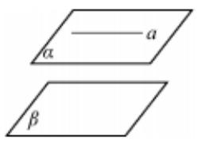</td><td> $\begin{array}{c}\alpha\parallel \beta \\ a \subset \alpha \end{array} \Rightarrow a\parallel \beta$ </td></tr></table>

## 性质定理（文字语言、图形语言、符号语言）

<table><tr><td></td><td>文字语言</td><td>图形语言</td><td>符号语言</td></tr><tr><td>线||面⇒线||线</td><td>如果一条直线和一个平面平行,经过这条直线的平面和这个平面相交,那么这条直线就和交线平行</td><td>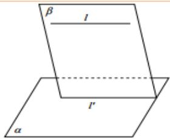</td><td> $\left.\begin{matrix} l\parallel & \alpha \\ l \subset \beta \\ \alpha \cap \beta = l' \end{matrix}\right\} \Rightarrow l\parallel$ </td></tr></table>

## 【即学即练】

1．如图，在正方体 $ABCD - A_{1}B_{1}C_{1}D_{1}$ 中，点 $G, E, F, P$ 分别为棱 $AB, D_{1}C_{1}, B_{1}C_{1}, AA_{1}$ 的中点，点 $M$ 是棱

$A_{1}D_{1}$ 上的一点，且 $MD_{1}=\frac{3}{4}A_{1}D_{1}$ ，求证： $D_{1}G//$ 平面 DBFE.

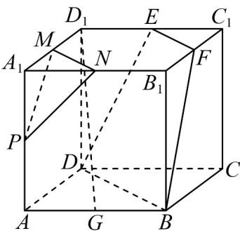

## 【答案】证明见解析

【分析】利用三角形相似得到比例关系，进而可得线线平行，结合判定定理可证结论

【详解】连接 $D_{1}C$ 、GC分别交DE、DB于点H、O，连接HO，

在正方体 $ABCD - A_{1}B_{1}C_{1}D_{1}$ 中， $D_{1}E // DC$ 且 $D_{1}E = \frac{1}{2} DC$

所以 $\triangle HED_{1} \sim \triangle HDC$ ，则 $\frac{D_{1}H}{CH} = \frac{ED_{1}}{CD} = \frac{1}{2}$

同理可得 $\frac{GO}{CO} = \frac{BG}{CD} = \frac{1}{2}$ ，所以 $\frac{D_1H}{CH} = \frac{GO}{CO}$ ，所以 $HO / / D_1G$

又 $HO \subset$ 平面 DBFE， $D_{1}G \not\subset$ 平面 DBFE，所以 $D_{1}G //$ 平面 DBFE·

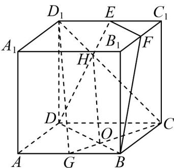

2．已知正四棱柱 $ABCD - A_{1}B_{1}C_{1}D_{1}$ 的底面边长为 1，点 $E$ 、 $F$ 分别在边 $AD$ 、 $CD$ 上，且 $AE = \frac{2}{3}$ ， $CF = \frac{2}{3}$ ·证

明： $AC \parallel$ 平面 $B_{1}EF$

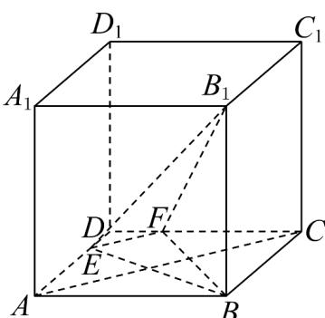

【答案】证明见解析

【分析】由线段比例关系得到 $AC \parallel EF$ ，进而可求证·

【详解】因为 $AE=\frac{2}{3}$ ， $CF=\frac{2}{3}$ ，则 $\frac{ED}{AE}=\frac{DF}{FC}=\frac{1}{2}$ ，可得 $AC//EF$ ，

且 $AC \not\subset$ 平面 $B_{1}EF$ ， $EF \subset$ 平面 $B_{1}EF$ ，

所以 $AC \parallel$ 平面 $B_{1}EF$ .

## 知识点 09 两个平面平行

## 判定方法（文字语言、图形语言、符号语言）

<table><tr><td></td><td>文字语言</td><td>图形语言</td><td>符号语言</td></tr><tr><td rowspan="2">判定定理</td><td rowspan="2">如果一个平面内有两条相交的直线都平行于另一个平面,那么这两个平面平行(简记为“线面平行⇒ 面面平行)</td><td rowspan="2"></td><td>a⊂α,b⊂α,a∩b=P</td></tr><tr><td>a∥β,b∥β⇒α∥β</td></tr><tr><td>线∥面⇒ 面</td><td>如果两个平面同垂直于一条直线,那么这两个平面平行</td><td></td><td>l⊥αl⊥β⇒α∥β</td></tr></table>

性质定理（文字语言、图形语言、符号语言）

<table><tr><td></td><td>文字语言</td><td>图形语言</td><td>符号语言</td></tr><tr><td>面//面⇒线//面</td><td>如果两个平面平行,那么在一个平面中的所有直线都平行于另外一个平面</td><td></td><td> $\left.\begin{matrix} \alpha //\beta \\ a \subset \alpha \end{matrix}\right\} \Rightarrow a //\beta$ </td></tr><tr><td>性质定理</td><td>如果两个平行平面同时和第三个平面相交,那么他们的交线平行(简记为“面面平行⇒线面平行”)</td><td></td><td> $\left.\begin{matrix} \alpha //\beta \\ \alpha \cap \gamma = a \\ \beta \cap \gamma = b \end{matrix}\right\} \Rightarrow a //b$ </td></tr><tr><td>面//面⇒线⊥面</td><td>如果两个平面中有一个垂直于一条直线,那么另一个平面也垂直于这条直线</td><td>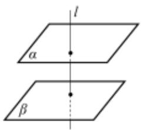</td><td> $\left.\begin{matrix} \alpha //\beta \\ l \perp \alpha \end{matrix}\right\} \Rightarrow l \perp \beta$ </td></tr></table>

方法技巧与总结：线线平行、线面平行、面面平行的转换如图所示。

(1) 证明直线与平面平行的常用方法：

① 利用定义，证明直线 $a$ 与平面 $\alpha$ 没有公共点，一般结合反证法证明；

②利用线面平行的判定定理，即线线平行 $\Rightarrow$ 线面平行．辅助线的作法为：平面外直线的端点进平面，同向进

面，得平行四边形的对边，不同向进面，延长交于一点得平行于第三边的线段；

③利用面面平行的性质定理，把面面平行转化成线面平行；

(2) 证明面面平行的常用方法：

①利用面面平行的定义，此法一般与反证法结合；

②利用面面平行的判定定理；

③利用两个平面垂直于同一条直线；

④证明两个平面同时平行于第三个平面.

(3) 证明线线平行的常用方法：①利用直线和平面平行的判定定理；②利用平行公理；

## 【即学即练】

1．如图，在四棱锥 P-ABCD 中， $AB//CD$ ， $AB\perp BC$ ， $2AB=2BC=CD=PD=PC$ ，设 E,F,M 分别为棱

AB,PC,CD 的中点，证明： $EF//$ 平面 PAM .

【答案】证明见解析

【分析】利用平行四边形来证明线线平行或利用 $A$ 字形来证明线线平行，从而可证明线面平行；也可以利用

面面平行来证明线面平行·

【详解】解法一：构造平行四边形

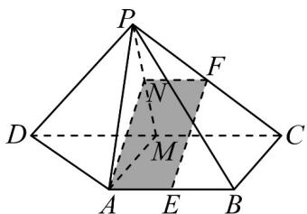

取 $PM$ 的中点 $N$ ，连接 $AN, NF,$ 则 $NF//CM$ ，且 $2NF = CM$

又因为 $AE // CM$ ，且 $2AE = CM$ ，所以 $NF // AE$ ， $NF = AE$

即四边形 $AEFN$ 为平行四边形，则 $EF//AN$

又 $AN \subset$ 平面 $PAM$ ， $EF \subset$ 平面 $PAM$ ，所以 $EF //$ 平面 $PAM$ 。

解法二：构造面面平行

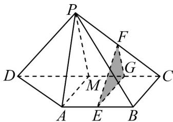

取 CM 的中点 G，连接 GE, GF，因为 E, F 分别为棱 AB, PC 的中点，

所以 $GF // PM, GE // AM,$

又因为 $GF \not\subset$ 平面 PAM ，GE $\not\subset$ 平面 PAM ，PM $\subset$ 平面 PAM ，AM $\subset$ 平面 PAM ，

所以 $GF / /$ 平面PAM， $GE / /$ 平面PAM，

又因为 $GF \cap GE = G, GF, GE \subset$ 平面 EFG ，所以平面 EFG // 平面 PAM ，

又因为 $EF \subset$ 平面 $EFG$ ，所以 $EF //$ 平面 $PAM$ 。

解法三：构造 $A$ 字形相似

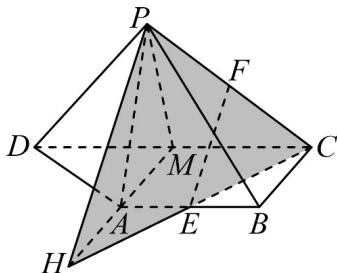

延长 MA, CE 相交于点 H，连接 PH，由 2AB = CD，E, M 分别为棱 AB, CD 的中点，

所以 $AE = \frac{1}{2} CM$ ，又因为 $AB / / CD$ ，所以 $HE = CE$ ，

又因为 PF = FC ，所以 $EF \parallel PH$ ，

又 $PH \subset$ 平面 PAM ， $EF \not\subset$ 平面 PAM ， 所以 $EF \parallel$ 平面 PAM .

2．如图，在长方体 $ABCD-A_{1}B_{1}C_{1}D_{1}$ 中，AB=BC=6， $AA_{1}=3$ ，点 P,Q 分别为 BC， $C_{1}D_{1}$ 的中点，点 M 为

【答案】

长方形 $ADD_{1}A_{1}$ 内一动点（含边界），若直线 $QM //$ 平面 $APC_{1}$ ，则点 $M$ 的轨迹长度为（）

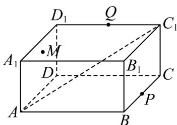

A. $\sqrt{6}$ B. $2\sqrt{2}$ C. $2\sqrt{3}$ D. $3\sqrt{2}$

【答案】D

【分析】利用过点 $Q$ 作平面 $APC_{1}$ 的平行平面 $QEF$ ，从而可得点 $M$ 的轨迹为线段 $EF$ ，即可计算长度，得出

结果·

【详解】

在长方体 $ABCD - A_{1}B_{1}C_{1}D_{1}$ 中，取 $A_{1}D_{1}$ ， $B_{1}C_{1}$ 的中点 $G$ ， $H$ ，连接 $AG$ ， $GH$ ， $BH$ 由点 $P$ 为 $BC$ 的中点，得 $C_{1}H // BP$ ， $C_{1}H = BP$ ，则四边形 $BPC_{1}H$ 是平行四边形，所以 $BH // C_{1}P$ ，

又 $GH / / A_1B_1 / / AB$ ， $GH = A_{1}B_{1} = AB$ ，则四边形ABHG是平行四边形，

于是 $AG // BH // C_{1}P$

取 $GD_{1}$ 中点E，在AD上取点F，使得AF=GE，连接EF，QE，QF，

而 $AF // GE$ ，则四边形AGEF为平行四边形， $EF // AG$

而 $AG \subset$ 平面 $APC_{1}$ ， $EF \not\subset$ 平面 $APC_{1}$

于是 $EF / /$ 平面 $APC_{1}$

由 $Q$ 为 $C_1D_1$ 的中点， $E$ 为 $GD_{1}$ 中点，得 $QE // C_{1}G$

而 $C_{1}G \subset$ 平面 $APC_{1}$ ， $QE \notin$ 平面 $APC_{1}$ ，则 $QE //$ 平面 $APC_{1}$ ，

又 $EF \cap QE = E$ ，EF, QE ⊂ 平面 QEF，

因此平面 $QEF \parallel$ 平面 $APC_{1}$

又由直线 $QM \parallel$ 平面 $APC_{1}$ ，点 $M \in$ 平面 $ADD_{1}A_{1}$ ，

则点 M 在平面 QEF 与平面 $ADD_{1}A_{1}$ 的交线 EF 上，

从而点 M 的轨迹就是线段 EF ，

$$
\text {而} E F = A G = \sqrt {A _ {1} G ^ {2} + A _ {1} A ^ {2}} = 3 \sqrt {2}
$$

所以点 M 的轨迹长度为 $3\sqrt{2}$ .

故选：D.

## 知识点 10 直线、平面垂直的判定与性质

判定定理（文字语言、图形语言、符号语言）

<table><tr><td></td><td>文字语言</td><td>图形语言</td><td>符号语言</td></tr><tr><td>判断定理</td><td>一条直线与一个平面内的两条相交直线都垂直,则该直线与此平面垂直</td><td></td><td> $\left.\begin{matrix}a,b\subset\alpha \\a\perp l \\b\perp l \\a\cap b=P\end{matrix}\right\} \Rightarrow l\perp\alpha$ </td></tr><tr><td>面⊥面⇒线⊥面</td><td>两个平面垂直,则在一个平面内垂直于交线的直线与另一个平面垂直</td><td>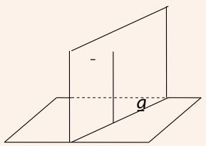</td><td>α⊥βα∩β=a b⊂β b⊥a⇒b⊥α</td></tr><tr><td>平行与垂直的关系</td><td>一条直线与两平行平面中的一个平面垂直,则该直线与另一个平面也垂直</td><td>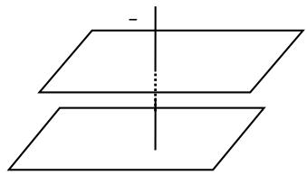</td><td>α∥βa⊥α⇒a⊥β</td></tr><tr><td>平行与垂直的关系</td><td>两平行直线中有一条与平面垂直,则另一条直线与该平面也垂直</td><td>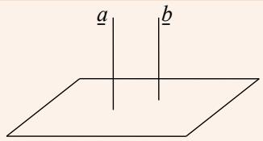</td><td>a∥ba⊥α⇒b⊥α</td></tr></table>

性质定理（文字语言、图形语言、符号语言）

<table><tr><td></td><td>文字语言</td><td>图形语言</td><td>符号语言</td></tr><tr><td>性质定理</td><td>垂直于同一平面的两条直线平行</td><td></td><td> $\left.\begin{matrix}a//\alpha \\a\subset\beta \\\alpha\cap\beta=b\end{matrix}\right\} \Rightarrow a//$ </td></tr></table>

<table><tr><td></td><td>文字语言</td><td>图形语言</td><td>符号语言</td></tr><tr><td>垂直与平行的关系</td><td>垂直于同一直线的两个平面平行</td><td></td><td> $\left.\begin{matrix}a \perp \alpha \\ a \perp \beta\end{matrix}\right\} \Rightarrow \alpha // \beta$ </td></tr><tr><td>线垂直于面的性质</td><td>如果一条直线垂直于一个平面,则该直线与平面内所有直线都垂直</td><td></td><td> $l \perp \alpha, a \subset \alpha \Rightarrow l \perp a$ </td></tr></table>

平面与平面垂直的定义

如果两个相交平面的交线与第三个平面垂直，又这两个平面与第三个平面相交所得的两条交线互相垂直。

(如图所示，若 $\alpha\cap\beta=CD,CD\perp\gamma$ ，且 $\alpha\cap\gamma=AB,\beta\cap\gamma=BE,AB\perp BE$ ，则 $\alpha\perp\beta$ )

一般地，两个平面相交，如果它们所成的二面角是直二面角，就说这两个平面互相垂直。

判定定理（文字语言、图形语言、符号语言）

<table><tr><td></td><td>文字语言</td><td>图形语言</td><td>符号语言</td></tr><tr><td>判定定理</td><td>一个平面过另一个平面的垂线,则这两个平面垂直</td><td>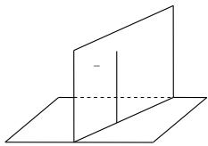</td><td> $\left.\begin{matrix}b \perp \alpha \\ b \subset \beta\end{matrix}\right\} \Rightarrow \alpha \perp \beta$ </td></tr></table>

性质定理（文字语言、图形语言、符号语言）

<table><tr><td></td><td>文字语言</td><td>图形语言</td><td>符号语言</td></tr><tr><td>性质定理</td><td>两个平面垂直,则一个平面内垂直于交线的直线与另一个平面垂直</td><td>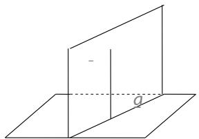</td><td> $\left.\begin{matrix}\alpha\perp\beta \\ \alpha\cap\beta=a \\ b\subset\beta \\ b\perp a\end{matrix}\right\} \Rightarrow b\perp\alpha$ </td></tr></table>

方法技巧与总结：

线⊥线 $\xleftarrow{判定定理}$ 线⊥面 $\xleftarrow{判定定理}$ 面⊥面
性质定理 性质定理

(1) 证明线线垂直的方法

①等腰三角形底边上的中线是高；②勾股定理逆定理；③菱形对角线互相垂直；④直径所对的圆周角是直角；

⑤向量的数量积为零；⑥线面垂直的性质 $(a\perp\alpha,b\subset\alpha\Rightarrow a\perp b)$ ；⑦平行线垂直直线的传递性（

$$
a \perp c, a / / b \Rightarrow b \perp c) .
$$

(2) 证明线面垂直的方法

①线面垂直的定义；②线面垂直的判定（ $a \perp b, a \perp c, c \subset \alpha, b \subset \alpha, b \cap c = P \Rightarrow a \perp \alpha$ ）；③面面垂直的性质（

$\alpha\perp\beta,\alpha\cap\beta=b,a\perp b,a\subset\alpha\Rightarrow a\perp\beta$ ；平行线垂直平面的传递性 $(a\perp\alpha,b//a\Rightarrow b\perp\alpha)$ ；

⑤面面垂直的性质（ $\alpha\perp\gamma,\beta\perp\gamma,\alpha\cap\beta=l\Rightarrow l\perp\gamma$ ）.

(3) 证明面面垂直的方法

① 面面垂直的定义；② 面面垂直的判定定理（ $a \perp \beta, a \subset \alpha \Rightarrow \alpha \perp \beta$ ）.

空间中的线面平行、垂直的位置关系结构图如图所示，由图可知，线面垂直在所有关系中处于核心位置。

## 【即学即练】

1. 设 $\alpha$ ， $\beta$ 是两个平面， $a$ ， $b$ 是两条直线，则下列命题为真命题的是（ ）A．若 $\alpha \perp \beta$ ， $a \parallel \alpha$ ， $b \parallel \beta$ ，则 $a \perp b$ B．若 $a \subset \alpha$ ， $b \subset \beta$ ， $a \parallel b$ ，则 $\alpha \parallel \beta$ C．若 $\alpha \cap \beta = a$ ， $b \parallel \alpha$ ， $b \parallel \beta$ ，则 $a \parallel b$ D．若 $a \perp \alpha$ ， $b \perp \beta$ ， $a \parallel b$ ，则 $\alpha \perp \beta$

【答案】C

【分析】利用反例可判断 A,B,D 选项，根据线面平行的性质和判定定理可判断 C 选项.

【详解】如图，正方体中，记底面 ABCD 为平面 $\alpha$ ，侧面 $ADD_{1}A_{1}$ 为平面 $\beta$ ， $B_{1}C_{1}$ 为 a，BC 为 b

显然满足 $\alpha \perp \beta$ ， $a\| \alpha$ ， $b\| \beta$ ，但是此时 $a / / b$ ，A不正确；

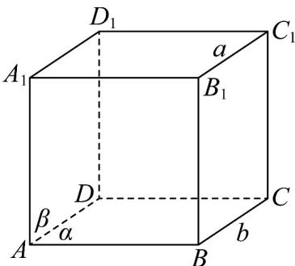

如图，满足 $a \subset \alpha$ ， $b \subset \beta$ ， $a \parallel b$ ，但是此时 $\alpha \perp \beta$ ， $^{\mathrm{B}}$ 不正确；

因为 $b / / \alpha, b / / \beta$ ，所以存在平面 $\gamma$ ，使得 $b \subset \gamma, \gamma \cap \alpha = m, \gamma \cap \beta = n$ ，根据线面平行的性质定理可得 $b / / m, b / / n$

所以 $m / / n$ ，又因为 $m\not\subset \beta ,n\subset \beta$ ，根据线面平行的判定定理可得 $m / / \beta$

而 $m \subset \alpha, \alpha \cap \beta = a$ ，所以 $m // a$ ，又因为 $b // m$ ，所以 $a // b$ ，C 正确；

因为 $a \perp \alpha$ ， $a // b$ ，所以 $b \perp \alpha$ ，因为 $b \perp \beta$ ，所以 $\alpha // \beta$ ，D 不正确。

故选：C.

2. 已知三个不同的平面 $\alpha, \beta, \gamma$ 和三条不同的直线 $m, n, l$ ，下列命题中为假命题的是（）

【答案】
A. 若 $m // n, m \perp \alpha$ ，则 $n \perp \alpha$ B. 若 $m // n, m // \alpha$ ，则 $n // \alpha$

C．若 $\alpha\cap\beta=m,\quad n\subset\alpha,\quad l\subset\beta,\quad n//l$ ，则 $m//n//l$

D. 若 $\alpha \perp \gamma$ ， $\alpha // \beta$ ，则 $\beta \perp \gamma$

【答案】B

【分析】利用空间线面的位置关系逐个判断即可·

【详解】因为 $m \parallel n$ ， $m \perp \alpha$ ，所以 $n \perp \alpha$ ， $^{A}$ 正确；

若 $m / / n$ ， $m / / \alpha$ ，则 $n / / \alpha$ 或 $n \subset \alpha$ ，B不正确；

因为 $n / / l$ ， $n\not\subset \beta$ ， $l\subset \beta$ ，所以 $n / / \beta$

因为 $\alpha\cap\beta=m,\quad n\subset\alpha,\quad n//\beta$ ，根据线面平行的性质定理，所以 $n//m$ ，又 $n//l$ ，所以 $m//n//l$ ，C 正确；

因为 $\alpha \perp \gamma$ ， $\alpha //\beta$ ，所以 $\beta \perp \gamma$ ，D 正确.

故选：B

## 题型精讲

![[高中/课堂同步/题库/人教A版高中数学同步讲义(2026)/02_必修第二册/第八章 立体几何初步/第八章 立体几何初步（高效培优讲义）/题型01_空间几何体的表面积与体积/题型01_空间几何体的表面积与体积.md]]
![[高中/课堂同步/题库/人教A版高中数学同步讲义(2026)/02_必修第二册/第八章 立体几何初步/第八章 立体几何初步（高效培优讲义）/题型02_直观图/题型02_直观图.md]]
![[高中/课堂同步/题库/人教A版高中数学同步讲义(2026)/02_必修第二册/第八章 立体几何初步/第八章 立体几何初步（高效培优讲义）/题型03_证明_点共面___线共面_或_点共线_及_线共点_/题型03_证明_点共面___线共面_或_点共线_及_线共点_.md]]
![[高中/课堂同步/题库/人教A版高中数学同步讲义(2026)/02_必修第二册/第八章 立体几何初步/第八章 立体几何初步（高效培优讲义）/题型04_截面问题/题型04_截面问题.md]]
![[高中/课堂同步/题库/人教A版高中数学同步讲义(2026)/02_必修第二册/第八章 立体几何初步/第八章 立体几何初步（高效培优讲义）/题型05_异面直线的判定/题型05_异面直线的判定.md]]
![[高中/课堂同步/题库/人教A版高中数学同步讲义(2026)/02_必修第二册/第八章 立体几何初步/第八章 立体几何初步（高效培优讲义）/题型06_平行与垂直的判定/题型06_平行与垂直的判定.md]]
![[高中/课堂同步/题库/人教A版高中数学同步讲义(2026)/02_必修第二册/第八章 立体几何初步/第八章 立体几何初步（高效培优讲义）/题型07_线面平行处理技巧/题型07_线面平行处理技巧.md]]
![[高中/课堂同步/题库/人教A版高中数学同步讲义(2026)/02_必修第二册/第八章 立体几何初步/第八章 立体几何初步（高效培优讲义）/题型08_证明线线垂直/题型08_证明线线垂直.md]]
![[高中/课堂同步/题库/人教A版高中数学同步讲义(2026)/02_必修第二册/第八章 立体几何初步/第八章 立体几何初步（高效培优讲义）/题型09_证明线面垂直/题型09_证明线面垂直.md]]
![[高中/课堂同步/题库/人教A版高中数学同步讲义(2026)/02_必修第二册/第八章 立体几何初步/第八章 立体几何初步（高效培优讲义）/强化训练/强化训练.md]]
