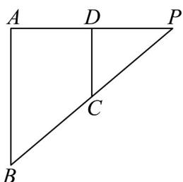
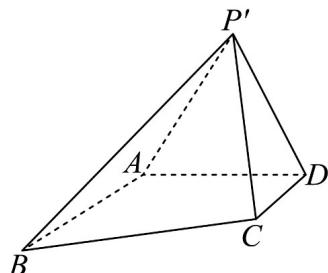

<!-- question-source:start -->
2．如图1，在 $\triangle PAB$ 中， $PA\bot AB$ ， $PA = 2\sqrt{3}$ ， $D,C$ 分别是 $PA,PB$ 的中点，现将 $\triangle PDC$ 沿 $DC$ 逆时针翻折

形成四棱锥 $P^{\prime} - ABCD$ （如图2），且 $P^{\prime}A = \sqrt{3}$ ，直线 $P^{\prime}C$ 与平面 $P^{\prime}AD$ 所成的角为 $45^{\circ}$

图1
图2

(1)求证：平面 $P^{\prime}AB \perp$ 平面 $P^{\prime}AD$ ；

(2)求二面角 $C - P'A - D$ 的正切值.
<!-- question-source:end -->

![[高中/课堂同步/题库/人教A版高中数学同步讲义(2026)/02_必修第二册/第八章 立体几何初步/第八章 立体几何初步（高效培优讲义）/强化训练/questions/answers/Q00069954A1.md]]
