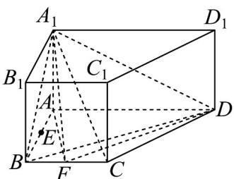

<!-- question-source:start -->
3．已知在直四棱柱 $ABCD-A_{1}B_{1}C_{1}D_{1}$ 中，底面 ABCD 为直角梯形，且满足 $AD \perp AB$ ，AD = 4，AB = 2， $\angle BCD=135^{\circ}$ ， $BB_{1}=2$ ，E，F分别是线段AB，BC的中点.

(1)求直线 $A_{1}F$ 和平面 $BCD$ 的夹角的正弦值；

(2)求证：平面 $A_{1}BD \perp$ 平面 $A_{1}AF$ ；

(3)棱 $AA_{1}$ 上是否存在点 $G$ ，使 $EG / /$ 平面 $A_{1}FD$ ，若存在，确定点 $G$ 的位置，若不存在，请说明理由.
<!-- question-source:end -->

![[高中/课堂同步/题库/人教A版高中数学同步讲义(2026)/02_必修第二册/第八章 立体几何初步/第八章 立体几何初步（高效培优讲义）/强化训练/questions/answers/Q00069955A1.md]]
