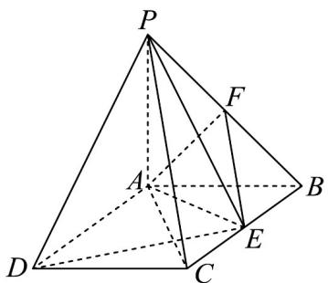

<!-- question-source:start -->
10．如图，已知 $PA \perp$ 平面ABCD，四边形ABCD是矩形， $PA = AB = 1, AD = \sqrt{3}$ ， $E$ ， $F$ 分别是 $BC$ 和 $PB$ 的中

点.

(1)求证： $EF \parallel$ 平面 PAC；

(2)求证： $AF \perp PE$ ；

(3)求三棱锥 E - PAD 的体积.
<!-- question-source:end -->

![[高中/课堂同步/题库/人教A版高中数学同步讲义(2026)/02_必修第二册/第八章 立体几何初步/第八章 立体几何初步（高效培优讲义）/强化训练/questions/answers/Q00069961A1.md]]
