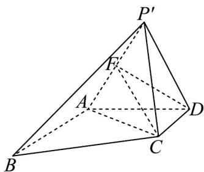

> [!faq]- 《第八章 立体几何初步（高效培优讲义）》官方解析
>
> > [!success]- **【答案】** (1)证明见解析 $$ 2 \sqrt {3} $$ (2) $\overline{3}$
>
> > [!note]- **【分析】**
> > （1）由已知先证明 $AB \perp$ 平面 $P'AD$ ，然后由面面垂直的判定定理即可证明；
> >
> > (2) 连接 AC，过点 D 作 $DF \perp AP'$ ，垂足为 F，连接 CF，得出二面角 $C - P'A - D$ 的平面角为 $\angle CFD$ ，即
> >
> > 可求解·
>
> > [!note]- **【解析】**
> > （1）因为 D, C 分别是 PA, PB 的中点，所以 CD // AB
> >
> > 因为 $PA \perp AB$ ，所以 $CD \perp AP$ ，则 $CD \perp AD$ ， $CD \perp PD$ ，即 $CD \perp P'D$
> >
> > 又因为 $AD \cap P'D = D$ ， $AD, P'D \subset$ 平面 $P'AD$ ，所以 $CD \perp$ 平面 $P'AD$
> >
> > 故 $AB \perp$ 平面 $P'AD$ ，又 $AB \subset$ 平面 $P'AB$
> >
> > 所以平面 $P^{\prime}AB \perp$ 平面 $P^{\prime}AD \cdot$
> >
> > (2) 连接 AC，过点 D 作 $DF \perp AP'$ ，垂足为 F，连接 CF，如图所示，
> >
> > 因为 $CD \perp$ 平面 $P'AD$ ，直线 $P'C$ 与平面 $P'AD$ 所成的角为 $45^{\circ}$
> >
> > 所以 $\angle CP'D = 45^{\circ}$ ，即 $\angle CPD = 45^{\circ}$ ，
> >
> > 因为 $CD \parallel AB$ ， $PA \perp AB$ ，所以 $CD \perp AP$ ， $\triangle CDP$ 是等腰直角三角形，
> >
> > 可得 $CD = AD = PD = \frac{1}{2} PA = \sqrt{3}$ ，所以 $P^{\prime}A = AD = P^{\prime}D = \sqrt{3}$ ，即 $\triangle ADP'$ 为等边三角形，
> >
> > 则点 $F$ 为 $AP'$ 中点， $DF = \frac{\sqrt{3}}{2} \times \sqrt{3} = \frac{3}{2}$
> >
> > 在 Rt△ADC 中， $AC=\sqrt{AD^{2}+CD^{2}}=\sqrt{6}$ ，在 Rt△P'DC 中， $P'C=\sqrt{CD^{2}+P'D^{2}}=\sqrt{6}$ ，则 AC=CP'
> >
> > 由点 F 为 $AP'$ 中点得， $CF \perp AP'$
> >
> > 又 $CF \subset$ 平面 $ACP'$ ， $DF \subset$ 平面 $ADP'$ ，平面 $ACP' \cap$ 平面 $ADP' = AP'$ ，
> >
> > 所以二面角 $C - P'A - D$ 的平面角为 $\angle CFD$ ，
> >
> > 因为 $CD \perp$ 平面 $P'AD$ ， $DF \subset$ 平面 $P'AD$ ，所以 $CD \perp DF$ ，
> >
> > 在 $\int_{Rt^{\triangle}} CDF$ 中， $\tan\angle CFD=\frac{CD}{DF}=\frac{\sqrt{3}}{\frac{3}{2}}=\frac{2\sqrt{3}}{3}$ ，
> >
> > 所以二面角 $C - P'A - D$ 的正切值为 $\frac{2\sqrt{3}}{3}$ .
> >
> > 
