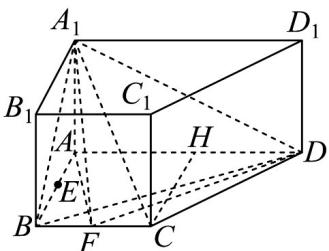
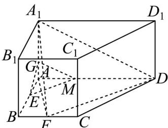
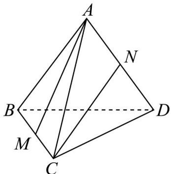
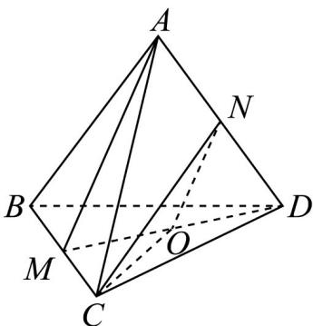

> [!faq]- 《第八章 立体几何初步（高效培优讲义）》官方解析
>
> > [!success]- **【答案】** (1) $\frac{2}{3}$ (2)证明见解析； (3)存在点 $G$ ，且 $AG = \frac{3}{4}$ ，使得 $EG / /$ 平面 $A_{1}FD$ ：
>
> > [!note]- **【分析】**
> > （1）根据线面角定义得出线面角为 $\angle A_{1}FA$ ，再结合边长关系计算求解；
> >
> > (2) 在直角梯形 $ABCD$ 中，过点 $C$ 作 $CH \perp AD$ 于 $H$ ，根据 $\triangle DAB \sim \triangle ABF$ 得到 $\angle BAF = \angle ADB$ ，利用线面
> >
> > 垂直的性质得到 $DB \perp AA_{1}$ ，从而得到 $DB \perp$ 面 $AA_{1}F$ ，再利用面面垂直的判定即可证明平面 $A_{1}BD \perp$ 平面 $A_{1}AF$ 。
> >
> > (2) 存在点 $G$ ，且 $AG = \frac{3}{4}$ ，则在 $AD$ 上取点 $M$ ，使 $AM = \frac{3}{8} AD = \frac{3}{2}$ ，连接 $EG$ ， $EM$ ， $MG$ ，易证
> >
> > $MG//A_{1}D$ ，EM//DF，从而得到 $EM//$ 平面 $A_{1}FD$ ， $MG//$ 平面 $A_{1}FD$ ，利用面面垂直的判定得到平面 $EMG//$
> >
> > 平面 $A_{1}FD$ ，从而得到 $EG / /$ 平面 $A_{1}FD$
>
> > [!note]- **【解析】**
> > （1）四棱柱 $ABCD-A_{1}B_{1}C_{1}D_{1}$ 是直四棱柱，所以 $AA_{1}\perp$ 平面 ABCD，
> >
> > 所以直线 $A_{1}F$ 和平面 BCD 的夹角为 $\angle A_{1}FA$ ，
> >
> > 在直角梯形 ABCD 中，过点 C 作 $CH \perp AD$ 于 H ，如图所示：
> >
> > 
> >
> > 由 $AD \perp AB$ ， $AD = 4$ ， $AB = 2$ ， $\angle BCD = 135^{\circ}$
> >
> > 得VCHD为等腰直角三角形，所以四边形ABCH为正方形，所以BC=2
> >
> > 所以 BF = 1 ，
> >
> > 在 $\triangle A_{1}FA$ 中， $A_{1}F = \sqrt{AA_{1}^{2} + AF^{2}} = \sqrt{AA_{1}^{2} + AB^{2} + BF^{2}} = \sqrt{4 + 4 + 1} = 3$
> >
> > $\sin\angle A_{1}FA=\frac{AA_{1}}{A_{1}F}=\frac{2}{3}$ 所以
> >
> > (2) 由 $AD \perp AB$ ，AD = 4，AB = 2， $\angle BCD = 135^{\circ}$ ，
> >
> > 得VCHD为等腰直角三角形，所以四边形ABCH为正方形，
> >
> > 所以 BF = 1， $\triangle DAB \sim \triangle ABF$ ，所以 $\angle BAF = \angle ADB$ ，
> >
> > 所以 $\angle BAF + \angle ABD = \angle ADB + \angle ABD = 90^{\circ}$
> >
> > 从而得到 $DB \perp AF$ ，
> >
> > 在直四棱柱 $ABCD-A_{1}B_{1}C_{1}D_{1}$ 中， $AA_{1}\perp$ 平面 ABCD，DB⊂平面 ABCD，
> >
> > 所以 $DB \perp AA_{1}$
> >
> > 又因为 $AF \cap AA_{1} = A, AF, AA_{1} \subset$ 平面 $AA_{1}F$ ，所以 $DB \perp$ 平面 $AA_{1}F$ ，
> >
> > 因为 $BD \subset$ 平面 $A_{1}BD$
> >
> > 所以平面 $A_{1}BD \perp$ 平面 $A_{1}AF$ ；
> >
> > (3) 存在点 G，且 $AG = \frac{3}{4}$ ，使得 $EG //$ 平面 $A_{1}FD$ ，
> >
> > 则在 $AD$ 上取点 $M$ ，使 $AM = \frac{3}{8} AD = \frac{3}{2}$ ，连接 $EG$ ， $EM$ ， $MG$ ，如图所示：
> >
> > 
> >
> > 此时 $\tan\angle AME=\frac{1}{\frac{3}{2}}=\frac{2}{3}$ ， $\tan\angle ADF=\frac{2}{3}$ ，
> >
> > 所以 $\angle AME = \angle ADF$ ，即 $EM / / DF$
> >
> > 在平面 $ADD_{1}A_{1}$ 中， $\frac{AG}{AA_{1}}=\frac{AM}{AD}=\frac{3}{8}$ ，所以 $MG//A_{1}D$
> >
> > 此时由 $EM \parallel DF$ ， $DF \subset$ 平面 $A_{1}FD$ ， $EM \not\subset$ 平面 $A_{1}FD$ ，得 $EM \parallel$ 平面 $A_{1}FD$
> >
> > 由 $MG / / A_{1}D$ ， $MG\notin$ 平面 $A_{1}FD$ ， $A_{1}D\subset$ 平面 $A_{1}FD$ ，得 $MG / /$ 平面 $A_{1}FD$
> >
> > 又 $MG \cap EM = M, MG, EM \subset$ 平面 $EMG$
> >
> > 所以平面 EMG// 平面 $A_{1}FD$ ，
> >
> > 因为 $EG \subset$ 平面 $EMG$ ，所以 $EG //$ 平面 $A_{1}FD$
> >
> > 4．空间四边形 ABCD 中，AB = BC = CD = DA = BD = AC = a，M，N 分别是 BC 与 AD 的中点，则异面直线
> > AM, CN 所成角的余弦值大小为（）
> >
> > 
> >
> > A. $\frac{1}{5}$ B. $\frac{2}{5}$ C. $\frac{2}{3}$ D. $\frac{3}{4}$
> >
> > 【答案】C
> >
> > 【分析】连接 DM，设 O 为 MD 的中点，连接 OC、ON，分析可知 $\angle ONC$ 为异面直线 AM 和 CN 所成的角
> >
> > （或补角），求出 $\triangle CON$ 的三边边长，结合余弦定理求解即可·
> >
> > 【详解】如图：连接 DM，设 O 为 MD 的中点，连接 OC、ON，
> >
> > 
> >
> > 因为 O、N 分别为 DM、AD 的中点，所以 $ON = \frac{1}{2} AM$ 且 ON // AM，
> >
> > 所以 $\angle ONC$ 为异面直线 AM 和 CN 所成的角（或补角），
> >
> > 因为 $\forall ABC$ 是边长为 $a$ 的等边三角形， $M$ 为 $BC$ 的中点，所以 $AM \perp BC$
> >
> > 所以 $AM = \sqrt{AB^{2} - BM^{2}} = \sqrt{a^{2} - \left(\frac{a}{2}\right)^{2}} = \frac{\sqrt{3}}{2} a$ ，同理可得 DM = CN = $\frac{\sqrt{3}}{2} a$
> >
> > 所以 $ON=\frac{1}{2}AM=\frac{\sqrt{3}}{4}a,\quad OM=\frac{1}{2}DM=\frac{\sqrt{3}}{4}a$
> >
> > $$
> > O C = \sqrt {M C ^ {2} + M O ^ {2}} = \sqrt {\left(\frac {a}{2}\right) ^ {2} + \left(\frac {\sqrt {3}}{4} a\right) ^ {2}} = \frac {\sqrt {7}}{4} a
> > $$
> >
> > 在 中由余弦定理可得： $\cos \angle ONC = \frac{ON^2 + CN^2 - OC^2}{2ON \cdot CN} = \frac{\frac{3a^2}{16} + \frac{3a^2}{4} - \frac{7a^2}{16}}{2 \times \frac{\sqrt{3}a}{4} \times \frac{\sqrt{3}a}{2}} = \frac{2}{3}$ ，
> >
> > 因此，异面直线 AM 和 CN 所成角的余弦值为 $\frac{2}{3}$
> >
> > 故选 **C**
