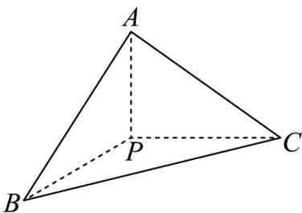

> [!faq]- 《第八章 立体几何初步（高效培优讲义）》官方解析
>
> > [!success]- **【答案】** $\frac{5}{3}$
>
> > [!note]- **【分析】**
> > 利用等体积法求得点 P 到平面 ABC 的距离，进而可求得点 G 到平面 ABC 的距离的最大值.
>
> > [!note]- **【解析】**
> > 因为 $PC \perp$ 平面 $PAB$ ， $PA$ ， $PB \subset$ 平面 $PAB$ ，所以 $PC \perp PA$ ， $PC \perp PB$
> >
> > 
> >
> > 又 $PC = 2$ ， $PA = PB = 1$ ，所以 $BC = AC = \sqrt{5}$ ，又 $AB = \sqrt{2}$
> >
> > 所以 $S_{ABC}=\frac{1}{2}AB\cdot\sqrt{AC^{2}-\left(\frac{AB}{2}\right)^{2}}=\frac{1}{2}\times\sqrt{2}\times\frac{3\sqrt{2}}{2}=\frac{3}{2}$ ，因为 PA=PB=1， $AB=\sqrt{2}$ ，
> >
> > 所以 $PA^2 + PB^2 = AB^2$ ，所以 $PA \perp PB$ ，设 $P$ 到平面 $ABC$ 的距离为 $h$
> >
> > 等体积法可得 $V_{P-ABC}=V_{C-PAB}$ ，即 $\frac{1}{3}\times\frac{1}{2}\times1\times1\times2=\frac{1}{3}\times\frac{3}{2}h$ ，解得 $h=\frac{2}{3}$ ，
> >
> > 所以点 $P$ 到平面 $ABC$ 的距离为 $\frac{2}{3}$
> >
> > 又 PG=1 ，所以点 G 到平面 ABC 的距离的最大值为 $h+PG=\frac{2}{3}+1=\frac{5}{3}$
