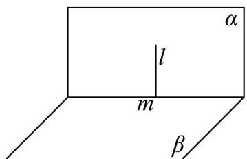
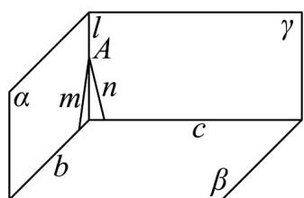

> [!faq]- 《第八章 立体几何初步（高效培优讲义）》官方解析
>
> > [!success]- **【答案】** A. 若 $m \perp \alpha, n // \alpha$ ，则 $m \perp n$ B. 若 $l \perp \beta, m \subset \alpha, l \perp m$ ，则 $\alpha // \beta$ C. 若 $\alpha // \gamma, \beta // \gamma$ ，则 $\alpha // \beta$ D. 若 $\alpha \perp \beta, \gamma \perp \beta, \alpha \cap \gamma = l$ ，则 $l \perp \beta$
>
> > [!note]- **【分析】**
> > 利用线面平行的性质与线面垂直的性质可判断 $^{A}$ ；可作出 $\alpha\cap\beta=m,\quad l\perp m,\quad l\subset\alpha$ 的图形判断 $^{B}$ ；
> >
> > 利用两平面平行的定义可判断 $^{C}$ ；利用反证法证明可判断 $^{D}$ .
>
> > [!note]- **【解析】**
> > 对于 A，作平面 $\beta$ ，使 $n \subset \beta$ 且 $\beta \cap \alpha = l$ ，因为 $n // \alpha$ ，所以 $n // l$ ，
> >
> > 又因为 $m \perp \alpha$ ， $l \subset \alpha$ ，所以 $m \perp l$ ，所以 $m \perp n$ ，故 A 正确；
> >
> > 对于 B，如图所示， $\alpha\cap\beta=m,\quad l\perp m,\quad l\subset\alpha$ ，满足 $l\perp\beta,\quad m\subset\alpha,\quad l\perp m$
> >
> > 但不满足 $\alpha//\beta$ ，故 B 错误；
> >
> > 对于 C，若 $\alpha//\gamma$ ， $\beta//\gamma$ ，则 $\alpha//\beta$ ，故 C 正确；
> >
> > 对于 D，因为 $\alpha \cap \gamma = l$ ，所以 $l \subset \alpha$ ， $l \subset \gamma$ ，取点 $A \in l$ ，则 $A \in \alpha$ ， $A \in \gamma$
> >
> > 假设直线 $l$ 与平面 $\beta$ 不垂直，又 $\alpha \perp \beta$
> >
> > 则过点 A 在平面 $\alpha$ 内可作一条直线与平面 $\beta$ 垂直，记为 m ，
> >
> > 
> >
> > 
> >
> > 同理，在平面 $\gamma$ 内过点 $A$ 可作直线 $n \perp \beta$ ，因为过点 $A$ 有且仅有一条直线垂直于平面 $\beta$
> >
> > 所以直线 m 与直线 n 重合，所以 $m \subset \alpha$ ， $m \subset \gamma$ ，所以 $\alpha \cap \gamma = m$ ，又 $\alpha \cap \gamma = l$ ，
> >
> > 与平面 $\alpha$ 与平面 $\gamma$ 有且仅有一条交线矛盾，故假设不成立，所以 $^{D}$ 正确.
> >
> > 故选 **B**.
