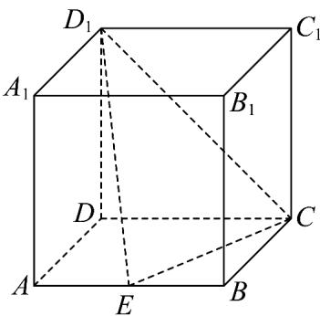

<!-- question-source:start -->
【变式1】如图，在正方体 $ABCD - A_{1}B_{1}C_{1}D_{1}$ 中， $E$ 为线段 $AB$ 的中点，过点 $C, E, D_{1}$ 的平面把正方体

$ABCD-A_{1}B_{1}C_{1}D_{1}$ 分成体积为 $V_{1}, V_{2} \left( V_{1} < V_{2} \right)$ 的两个几何体，则 $\frac{V_{1}}{V_{2}} =$ \_\_\_\_ .

<!-- question-source:end -->

![[高中/课堂同步/题库/人教A版高中数学同步讲义(2026)/02_必修第二册/第八章 立体几何初步/第八章 立体几何初步（高效培优讲义）/题型01_空间几何体的表面积与体积/questions/answers/Q00069926A1.md]]
