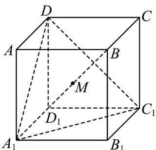

<!-- question-source:start -->
【变式1】如图，正方体 $ABCD - A_{1}B_{1}C_{1}D_{1}$ 中，对角线 $BD_{1}$ 与过 $A_{1}$ 、 $D$ 、 $C_1$ 的平面交于点 $M$ ，则 $BM:MD_{1} =$

<!-- question-source:end -->

![[高中/课堂同步/题库/人教A版高中数学同步讲义(2026)/02_必修第二册/第八章 立体几何初步/第八章 立体几何初步（高效培优讲义）/题型03_证明_点共面___线共面_或_点共线_及_线共点_/questions/answers/Q00069932A1.md]]
