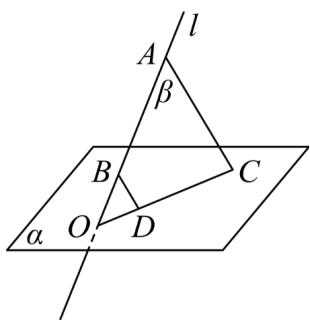

<!-- question-source:start -->
【变式2】若直线 $l$ 与平面 $\alpha$ 相交于点 $O, A, B \in l, C, D \in \alpha$ ，且 $AC // BD$ ，求证 $O, C, D$ 三点共线。

<!-- question-source:end -->

![[高中/课堂同步/题库/人教A版高中数学同步讲义(2026)/02_必修第二册/第八章 立体几何初步/第八章 立体几何初步（高效培优讲义）/题型03_证明_点共面___线共面_或_点共线_及_线共点_/questions/answers/Q00069933A1.md]]
