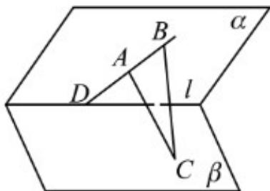

> [!faq]- 《第八章 立体几何初步（高效培优讲义）》官方解析
>
> > [!success]- **【答案】** $\gamma$ ，则平面 $\gamma$ ， $\beta$ 的交线必过（）  A.点 $A$ B.点 $B$ C.点 $C$ D.点 $D$
>
> > [!note]- **【分析】**
> > 根据平面的基本性质判断·
>
> > [!note]- **【解析】**
> > 因为 $A \in \alpha, A \in \gamma, B \in \alpha, B \in \gamma, C \in \beta, C \in \gamma, D \in \beta, D \in \gamma$
> >
> > 所以点 A 在 $\alpha$ 与 $\gamma$ 的交线上，点 B 在 $\alpha$ 与 $\gamma$ 的交线上，点 C 在 $\beta$ 与 $\gamma$ 的交线上，点 D 在 $\beta$ 与 $\gamma$ 的交线上，
> >
> > 故选 **CD**
