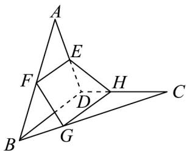
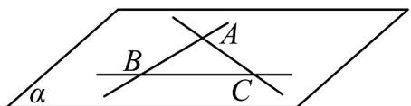

## 题型 03 证明“点共面”、“线共面”或“点共线”及“线共点”

【典例1】如图，空间四边形ABCD中，E,F分别是AD,AB的中点，G,H分别在BC,CD上，且

$$
B G: G C = D H: H C = 1: 2
$$

(1)求证： $E,F,G,H$ 四点共面；

(2)设 $FG$ 与 $HE$ 交于点 $P$ ，求证： $P,A,C$ 三点共线.

【答案】(1)证明见解析

(2)证明见解析

【分析】（1）证明四边形 EFGH 中有一对平行直线即可·

(2) 要证明 P, A, C 三点共线，可证明点 P 在直线 AC 上，即证明点 P 在平面 ABC 与平面 ACD 的交线上即可.

【详解】（1）证明：在 $\triangle ABD$ 中，∵E,F为AD,AB的中点，

$\therefore EF // BD$

在 $\triangle CBD$ 中，∵BG:GC=DH:HC=1:2

$$
\therefore G H \parallel B D, \therefore E F \parallel H G,
$$

$\therefore E, F, G, H$ 四点共面.

(2) $\because FG\cap HE = P$ ， $P\in FG$ ， $P\in HE$

∴ $P \in$ 平面 ABC ， $P \in$ 平面 ADC ，

又平面 $ABC \cap$ 平面 ADC = AC ，

∴ $P \in$ 直线 AC ∴ P, A, C 三点共线.

【典例2】如图，直线 $AB$ 、 $BC$ 、 $CA$ 两两相交，交点分别为 $A$ 、 $B$ 、 $C$ ，判断这三条直线是否共面，并说明理

由.

【答案】共面

【分析】根据平面的基本性质，以及点、线与面的位置关系，即可求解·

【详解】由直线 $AB \cap AC = A$ ，可得直线 AB, AC 在同一个平面内，设为平面 $\alpha$ ，

因为 $AB \subset$ 平面 $\alpha$ ，且 $B \in$ 直线 AB，所以 $B \in$ 平面 $\alpha$ ，

又因为 $AC \subset$ 平面 $\alpha$ ，且 $C \in$ 直线 AB，所以 $C \in$ 平面 $\alpha$ ，

因为 $B \in$ 直线 BC ， $B \in$ 直线 BC ，所以直线 $BC \subset$ 平面 $\alpha$

所以三条中线在同一个平面内·

## 方法技巧

要证明“点共面”、“线共面”可先由部分直线活点确定一个平面，再证其余直线或点也在该平面内（即纳入

法）；证明“点共线”可将线看作两个平面的交线，只要证明这些点都是这两个平面的公共点，根据公理3可

知这些点在交线上，因此共线，证明“线共点”问题是证明三条或三条以上直线交于一点，思路是：先证明两

条直线交于一点，再证明交点在第三条直线上.

![[高中/课堂同步/题库/人教A版高中数学同步讲义(2026)/02_必修第二册/第八章 立体几何初步/第八章 立体几何初步（高效培优讲义）/题型03_证明_点共面___线共面_或_点共线_及_线共点_/questions/Q00069932.md]]
![[高中/课堂同步/题库/人教A版高中数学同步讲义(2026)/02_必修第二册/第八章 立体几何初步/第八章 立体几何初步（高效培优讲义）/题型03_证明_点共面___线共面_或_点共线_及_线共点_/questions/Q00069933.md]]
![[高中/课堂同步/题库/人教A版高中数学同步讲义(2026)/02_必修第二册/第八章 立体几何初步/第八章 立体几何初步（高效培优讲义）/题型03_证明_点共面___线共面_或_点共线_及_线共点_/questions/Q00069934.md]]
