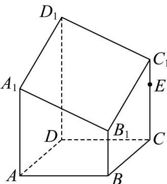

<!-- question-source:start -->
【变式3】如图，多面体 $ABCDA_{1}B_{1}C_{1}D_{1}$ 是用平面 $\alpha$ 截底面边长AB=2，侧棱长 $AA'=4$ 的长方体

$A^{\prime}B^{\prime}C^{\prime}D^{\prime} - ABCD$ 剩下的一部分几何体，其中 $DD_{1} = \frac{3}{2} AA_{1} = \frac{3}{2} CC_{1} = 3BB_{1} = 3$ ，点 $E$ 在线段 $CC_{1}$ 上，平面 $BED_{1}$

交线段 $AA_{1}$ 于点 $F$ ，则截面四边形 $BED_{1}F$ 的周长的最小值为 \_\_\_\_.

<!-- question-source:end -->

![[高中/课堂同步/题库/人教A版高中数学同步讲义(2026)/02_必修第二册/第八章 立体几何初步/第八章 立体几何初步（高效培优讲义）/题型04_截面问题/questions/answers/Q00069937A1.md]]
