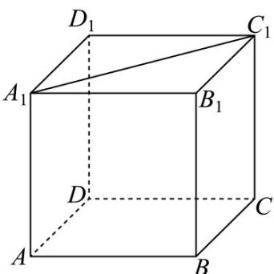
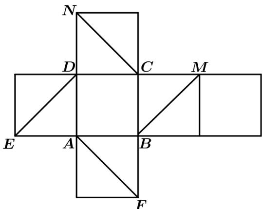
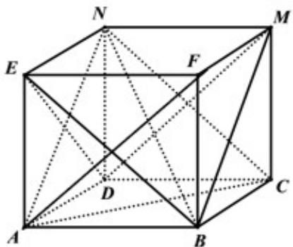

## 题型05 异面直线的判定

【典例1】如图所示，在正方体 $ABCD - A_{1}B_{1}C_{1}D_{1}$ 中，点 $P$ 为线段 $A_{1}C_{1}$ 上的动点，则下列直线中，始终与直线 $BP$ 异面的是（）

A. $DD_{1}$ B. $AC$ C. $AD_{1}$ D. $B_{1}C$

【答案】B

【分析】根据异面直线的定义一一判断即可·

【详解】由正方体的性质易知当 $P$ 为 $A_{1}C_{1}$ 的中点时， $P$ 为 $B_{1}D_{1}$ 的中点，

而 $DD_{1}//BB_{1}$ ，所以 B, D, $D_{1}, B_{1}$ 共面，则 BP、 $DD_{1}$ 在平面 $BDD_{1}B_{1}$ 上，故 A 不符题意；

因为 $AA_{1}//CC_{1}$ ，即 $A,C,C_{1},A_{1}$ 共面，

易知 $P \in$ 平面 $ACC_{1}A_{1}$ ，而 $B \notin$ 平面 $ACC_{1}A_{1}$ ， $P \in A_{1}C_{1}$ ， $P \notin AC$ ，

故 BP 与 AC 异面，故 B 符合题意；

当 P、 $C_{1}$ 重合时，易知 $AB // D_{1}C_{1}, AB = D_{1}C_{1}$

则四边形 $ABC_{1}D_{1}$ 是平行四边形，则此时 $AD_{1}//BP$ ，故 C 不符合题意；

当 P 、 $C_{1}$ 重合时，显然 $B_{1}C$ ， BP 相交，故 D 不符合题意

故选：B.

【典例2】如图是正方体的平面展开图，在这个正方体中，① $BM$ 与 $ED$ 平行；② $CN$ 与 $BE$ 是异面直线；

③ CN 与 BM 成 $60^{\circ}$ ; ④ DM 与 BN 垂直·以上四个命题中，正确命题的序号是（）

A. ①②③ B. ②④ C. ③④ D. ②③④

【答案】C

【分析】根据平面展开图可得原正方体，根据各点的分布逐项判断可得正确的选项。

【详解】由平面展开图可得原正方体如图所示：

由图可得：BM,ED 为异面直线，CN 与 BE 不是异面直线，故①②错误；

连接 AN, AC, DM, BN, BE，则 $\triangle ANC$ 为等边三角形，

而 $BM \parallel AN$ ，故 $\angle ANC$ 或其补角为 $CN$ 与 $BM$ 所成的角，

因为 $\angle ANC = 60^{\circ}$ ，故 CN 与 BM 所成的角为 $60^{\circ}$ ，故③正确；

因为 $DM \perp NC$ ，又 $BC \perp$ 平面 $CMND$ ，所以 $DM \perp BC$ ，故 $DM \perp$ 平面 $BCN$

又 $BN \subset$ 平面 $BCN$ ，所以 $DM \perp BN$ ，则④正确；

综上，正确命题的序号为：③④。

故选：C.

## 方法技巧

判定空间两条直线是异面直线的方法如下：

(1) 直接法：平面外一点 A 与平面内一点 B 的连线和平面内不经过 B 点的直线是异面直线.

(2) 间接法：平面两条不可能共面（平行，相交）从而得到两线异面.

![[高中/课堂同步/题库/人教A版高中数学同步讲义(2026)/02_必修第二册/第八章 立体几何初步/第八章 立体几何初步（高效培优讲义）/题型05_异面直线的判定/questions/Q00069938.md]]
![[高中/课堂同步/题库/人教A版高中数学同步讲义(2026)/02_必修第二册/第八章 立体几何初步/第八章 立体几何初步（高效培优讲义）/题型05_异面直线的判定/questions/Q00069939.md]]
![[高中/课堂同步/题库/人教A版高中数学同步讲义(2026)/02_必修第二册/第八章 立体几何初步/第八章 立体几何初步（高效培优讲义）/题型05_异面直线的判定/questions/Q00069940.md]]
