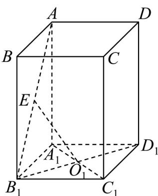

<!-- question-source:start -->
【变式3】已知 $ABCD - A_{1}B_{1}C_{1}D_{1}$ 是底面边长为 1 的正四棱柱，且 $AA_{1} = 2, O_{1}$ 是 $A_{1}C_{1}$ 与 $B_{1}D_{1}$ 的交点.

(1)若 $E$ 是 $AB_{1}$ 的中点，求证： $O_{1}E//$ 平面 $ADD_{1}A_{1}$ ；

(2)求 C 到平面 $EB_{1}O_{1}$ 的距离.
<!-- question-source:end -->

![[高中/课堂同步/题库/人教A版高中数学同步讲义(2026)/02_必修第二册/第八章 立体几何初步/第八章 立体几何初步（高效培优讲义）/题型07_线面平行处理技巧/questions/answers/Q00069946A1.md]]
