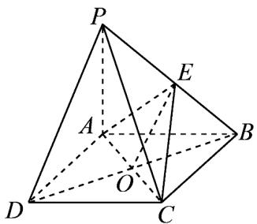

> [!faq]- 《第八章 立体几何初步（高效培优讲义）》官方解析
>
> > [!success]- **【答案】** (1)证明见详解 (2) $\frac{1}{3}$
>
> > [!note]- **【分析】**
> > （1）连接 BD 交 AC 于点 O，连接 OE，然后利用平行四边形的性质及线面平行的判断即可；
> >
> > (2) 利用等体积法求解即可，即 $V_{P-ACE} = V_{B-ACE}$
>
> > [!note]- **【解析】**
> > （1）证明：连接 BD 交 AC 于点 O，连接 OE，如图所示：
> >
> > 
> >
> > ∵ABCD 是平行四边形，
> >
> > $\therefore O$ 为 BD 中点，且 E 为 PB 中点，
> >
> > $\therefore OE\parallel PD$ ，且 $PD\not\subset$ 平面 ACE 内， $OE\subset$ 平面 ACE，
> >
> > ∴ PD ∥ 平面 ACE·
> >
> > (2) $\because BC^{2} = AB^{2} + AC^{2}$
> >
> > $\therefore Rt^{\triangle} ABC$ 的面积 $S=\frac{1}{2}\times2\times1=1$
> >
> > 又∵ $PA \perp$ 面ABCD，∴ $V_{P-ABC} = \frac{1}{3} \times 1 \times 2 = \frac{2}{3}$ ，
> >
> > 又∵E为PB中点，∴ $V_{P-ACE}=V_{B-ACE}=\frac{1}{3}$ ，
> >
> > 所以四面体 P-ACE 的体积为 $\frac{1}{3}$ .
