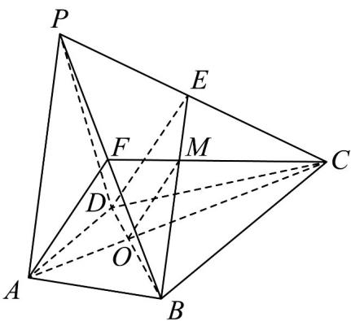

> [!faq]- 《第八章 立体几何初步（高效培优讲义）》官方解析
>
> > [!success]- **【答案】** (1)证明见解析 (2)证明见解析
>
> > [!note]- **【分析】**
> > （1）结合线面平行的判定定理和性质定理证得： $l//$ 平面 ABCD.
> >
> > (2) 结合线面平行的性质定理和三角形重心的知识证得： $AF \parallel DE \cdot$
>
> > [!note]- **【解析】**
> > （1）∵BC//AD，AD⊂平面PAD,BC∉平面PAD，∴BC//平面PAD.
> >
> > $\because BC \subset$ 平面 $PBC$ ，平面 $PBC \cap$ 平面 $PAD = l$ ， $\therefore BC // l$ .
> >
> > $\because BC \subset$ 平面 $ABCD, l \notin$ 平面 $ABCD$ ,
> >
> > ∴l// 平面ABCD.
> >
> > (2) 连接 AC, FC，设 $AC \cap BD = O$ ， $FC \cap BE = M$ ，连接 OM，
> >
> > ∵ AF∥平面 BDE, AF ⊂ 平面 AFC ，平面 AFC ∩ 平面 BDE = OM ，
> >
> > ∴ AF//OM
> >
> > ∵ AD∥BC，AD = $\frac{1}{2}$ BC，所以 $\frac{AO}{OC} = \frac{AD}{BC} = \frac{1}{2}$ ，
> >
> > $\therefore \frac{FM}{MC} = \frac{AO}{OC} = \frac{1}{2}$
> >
> > ∴点M是 $\triangle PBC$ 的重心，
> >
> > ∴点 E 是 PC 的中点，
> >
> > $$
> > \therefore \frac {E M}{M B} = \frac {1}{2} = \frac {D O}{O B}
> > $$
> >
> > $$
> > \therefore O M \parallel D E
> > $$
> >
> > ∴ AF//DE.
> >
> > 
