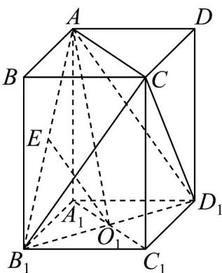

> [!faq]- 《第八章 立体几何初步（高效培优讲义）》官方解析
>
> > [!success]- **【答案】** (1)证明详见解析 (2) $\frac{4}{3}$
>
> > [!note]- **【分析】**
> > （1）通过构造中位线的方法证得 $O_{1}E//$ 平面 $ADD_{1}A_{1}$
> >
> > (2) 利用等体积法求得 C 到平面 $EB_{1}O_{1}$ 的距离.
>
> > [!note]- **【解析】**
> > （1）连接 $AD_{1}$ ，由于 $E, O_{1}$ 分别是 $AB_{1}, B_{1}D_{1}$ 的中点，
> >
> > 所以 $O_{1}E//AD_{1}$
> >
> > 由于 $O_{1}E \not\subset$ 平面 $ADD_{1}A_{1}$ ， $AD_{1} \subset$ 平面 $ADD_{1}A_{1}$ ，
> >
> > 所以 $O_{1}E \parallel$ 平面 $ADD_{1}A_{1}$ .
> >
> > (2) 连接 $CA, CB_1, CD_1, AO_1$ ，则 $C$ 到平面 $EB_1O_1$ 的距离是 $C$ 到平面 $AB_1D_1$ 的距离，设为 $h$ .
> >
> > $$
> > V _ {C - A B _ {1} D _ {1}} = 1 \times 1 \times 2 - \left[ \frac {1}{3} \times \left(\frac {1}{2} \times 1 \times 1\right) \times 2 \right] \times 4 = \frac {2}{3}
> > $$
> >
> > $$
> > A B _ {1} = A D _ {1} = \sqrt {5}, B _ {1} D _ {1} = \sqrt {2}, S _ {\triangle A B _ {1} D _ {1}} = \frac {1}{2} \times \sqrt {2} \times \sqrt {\left(\sqrt {5}\right) ^ {2} - \left(\frac {\sqrt {2}}{2}\right) ^ {2}} = \frac {3}{2},
> > $$
> >
> > $$
> > \frac {1}{3} \cdot S _ {\triangle A B _ {1} D _ {1}} \cdot h = \frac {1}{3} \cdot \frac {3}{2} \cdot h = \frac {2}{3}, h = \frac {4}{3},
> > $$
> >
> > 所以 C 到平面 $EB_{1}O_{1}$ 的距离是 $\frac{4}{3}$ .
> >
> > 
