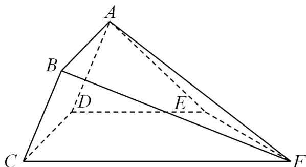
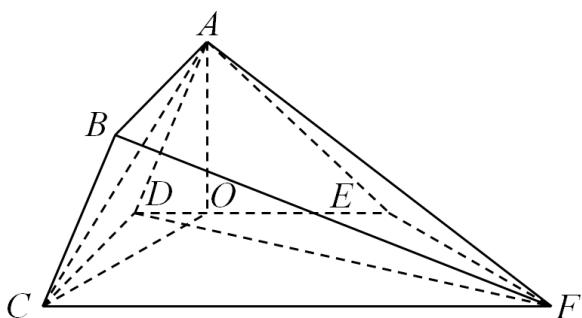
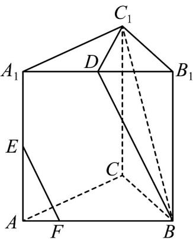
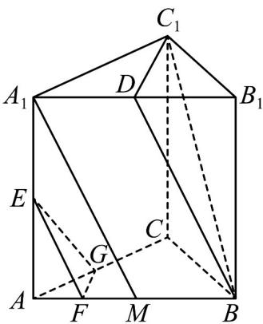
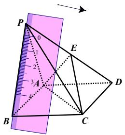
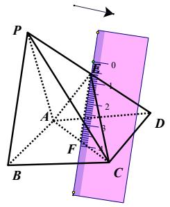
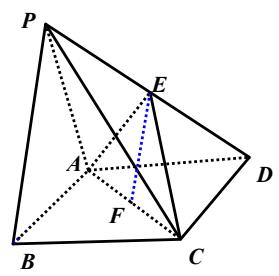
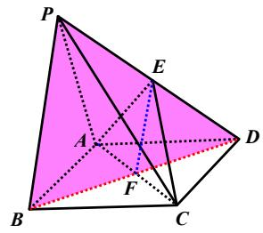

## 题型07 线面平行处理技巧

【典例1】如图，多面体 $ABCDEF$ 中，四边形ABCD为矩形，二面角 $A - CD - F$ 为 $45^{\circ}$ ， $DE / / CF$ ， $CD\perp DE$

$$
A D = 2 \quad D C = 3 \quad D E = 4 \quad C F = 5
$$

(1)求证： $BF//$ 平面 ADE；

(2)求直线 $AC$ 与平面 $CDEF$ 所成角的正弦值；

(3)求点 F 到平面 ABCD 的距离.

【答案】(1)证明见解析

(2) $\frac{\sqrt{26}}{13}$

(3) $\frac{5}{2}\sqrt{2}$

【分析】（1）由线面平行的判定定理可得 $AD \parallel$ 平面 $BCF$ ， $DE \parallel$ 平面 $BCF$ ，再由面面平行的判定定理和性质

定理可得答案；

(2) $\angle ADE$ 即为二面角 $A - CD - F$ 的平面角，作 $AO \perp DE$ 于 $O$ ，由线面垂直的判定定理可得 $CD \perp$ 平面

ADE，AO⊥平面CDEF，连结CO，直线AC与平面CDEF所成角为∠ACO，求出正弦值即可；

(3) 由 (2) 得 $AO \perp$ 平面 $CDEF$ , 又 $V_{F-ACD} = V_{A-CDF}$ , 可得答案.

【详解】（1）∵四边形ABCD是矩形，∴BC//AD，

$BC \subset$ 平面 $BCF$ ， $AD \notin$ 平面 $BCF$ ，所以 $AD //$ 平面 $BCF$ ，

∵ DE//CF，CF ⊂ 平面 BCF，DE ∉ 平面 BCF，所以 DE// 平面 BCF，

$AD \cap DE = D$ ， $\therefore$ 平面 $BCF //$ 平面 $ADE$ ， $\because BF \subset$ 平面 $BCF$ ， $\therefore BF //$ 平面 $ADE$ ；

(2) $\because CD \perp AD, CD \perp DE, \therefore \angle ADE$ 即为二面角 $A - CD - F$ 的平面角，

$$
\therefore \angle A D E = 4 5 ^ {\circ}
$$

又 $AD \cap DE = D$ ， $AD, DE \subset$ 平面 $ADE$

所以 $CD \perp$ 平面 ADE，作 $AO \perp DE$ 于 O，因为 $AO \subset$ 平面 ADE，

所以 $CD \perp AO$ ，又 $CD \cap DE = D$ ，CD、 $DE \subset$ 平面 CDEF，

所以 $AO \perp$ 平面 CDEF，连结 CO，

所以直线 AC 与平面 CDEF 所成角为 $\angle ACO$ ，

$AC = \sqrt{13}$ ， $AO = \sqrt{2}$ ，所以 $\sin \angle ACO = \frac{AO}{AC} = \frac{\sqrt{2}}{\sqrt{13}} = \frac{\sqrt{26}}{13}$

直线 $AC$ 与平面 $CDEF$ 所成角的正弦值为 $\frac{\sqrt{26}}{13}$ ；

(3) 由 (2) 得 $AO \perp$ 平面 $CDEF$ , 又 $V_{F-ACD} = V_{A-CDF}$ , 所以距离 $a = \frac{S_{\triangle ACD}}{S_{\triangle ACD}}$ , 又由已知可得

$$
d = \frac {S _ {\triangle C D F} \cdot A O}{S _ {\triangle A C D}}
$$

$S_{CDF} = \frac{15}{2}$ ， $S_{ACD} = 3$ ， $AO = \sqrt{2}$ ，所以 $d = \frac{5}{2}\sqrt{2}$

【典例2】如图，三棱柱 $ABC-A_{1}B_{1}C_{1}$ 中， $AA_{1}\perp$ 平面ABC，D、E分别为 $A_{1}B_{1}$ 、 $AA_{1}$ 的中点，点F在棱AB上。

且 $AF = \frac{1}{4} AB$

(1)求证： $EF^{\parallel}$ 平面 $BDC_{l}$ ；

(2)在棱 $AC$ 上是否存在一个点 $G$ ，使得平面 $EFG$ 将三棱柱分割成的两部分体积之比为 $1:15$ ，若存在，指出

点 $G$ 的位置；若不存在，说明理由。

【答案】(1)证明见解析

(2) 点 $G$ 不存在，理由见解析

【分析】（1）取 $AB$ 的中点 $M$ ，根据 $AF = \frac{1}{4} AB$ ，得到 $F$ 为 $AM$ 的中点，又 $E$ 为 $AA_{l}$ 的中点，根据三角形中位

线定理得 $EF^{\parallel}A_{1}M$ ，从而在三棱柱 $ABC - A_{1}B_{1}C_{1}$ 中， $A_{1}DBM$ 为平行四边形，进一步得出 $EF^{\parallel}B$ D．最后根据

线面平行的判定即可证出 $EF^{\parallel}$ 平面 $BC_{l}D$

(2) 对于存在性问题，可先假设存在，即假设在棱 $AC$ 上存在一个点 $G$ ，使得平面 $EFG$ 将三棱柱分割成的两

部分体积之比为 $1:15$ ，再利用棱柱、棱锥的体积公式，求出 $AG$ 与 $AC$ 的比值，若出现矛盾，则说明假设不

成立，即不存在；否则存在。

【详解】（1）证明：取 $AB$ 的中点 $M$ ，

$$
\because A F = \frac {1}{4} A B,
$$

∴F为AM的中点，

又∵E为 $AA_{1}$ 的中点，

$\therefore EF^{\parallel}A_{1}M$

在三棱柱 $ABC^{-}A_{1}B_{1}C_{1}$ 中，D，M 分别为 $A_{1}B_{1}$ ，AB 的中点，

$\therefore A_{1}D^{\parallel}BM, A_{1}D = BM$

$\therefore A_{1}DBM$ 为平行四边形， $\therefore AM^{\parallel}BD$

$\therefore EF^{\parallel}BD$

∵ $BD \subset$ 平面 $BC_{l}D$ ， $EF \nsubseteq$ 平面 $BC_{l}D$ ，

$\therefore EF^{\parallel}$ 平面 $BC_{1}D$ .

(2) 设 AC 上存在一点 G，使得平面 EFG 将三棱柱分割成两部分的体积之比为 1:15，则

$$
V _ {E - A F G}: V _ {A B C - A _ {1} B _ {1} C _ {1}} = 1: 1 6
$$

$$
\because \frac {V _ {E - A F G}}{V _ {A B C - A _ {1} B _ {1} C _ {1}}} = \frac {\frac {1}{3} \times \frac {1}{2} A F \cdot A G \sin \angle G A F \cdot A E}{\frac {1}{2} A B \cdot A C \sin \angle C A B \cdot A A _ {1}}
$$

$$
= \frac {1}{3} \times \frac {1}{4} \times \frac {1}{2} \times \frac {A G}{A C} = \frac {1}{2 4} \cdot \frac {A G}{A C}
$$

$$
\therefore \frac {1}{2 4} \cdot \frac {A G}{A C} = \frac {1}{1 6},
$$

$$
\therefore \frac {A G}{A C} = \frac {3}{2}
$$

$$
\therefore A G = \frac {3}{2} A C > A C
$$

所以符合要求的点 $G$ 不存在.

方法技巧

（1）初学者可以拿一把直尺放在 $PB$ 位置（与 $PB$ 平齐），如图一；

（2）然后把直尺平行往平面 $ACE$ 方向移动，直到直尺第一次落在平面 $ACE$ 内停止，如图二；

（3）此时刚好经过点 $E$ （这里熟练后可以直接凭数感直接找到点 $E$ ），此时直尺所在的位置就是我们要找

的平行线，直尺与 $AC$ 相交于点 $F$ ，连接 $EF$ ，如图三；

（4）此时 $PB$ 、 $EF$ 长度有长有短，连接 $PB$ 、 $EF$ 并延长刚好交于一点 $D$ ，刚好构成 $A$ 型模型（ $E$ 为 $PD$ 中点，

则 $F$ 也为 $BD$ 中点，若 $E$ 为等分点，则 $F$ 也为 $BD$ 对应等分点）， $PB \parallel EF$ ，如图四。

图一

图二

图三

图四

![[高中/课堂同步/题库/人教A版高中数学同步讲义(2026)/02_必修第二册/第八章 立体几何初步/第八章 立体几何初步（高效培优讲义）/题型07_线面平行处理技巧/questions/Q00069944.md]]
![[高中/课堂同步/题库/人教A版高中数学同步讲义(2026)/02_必修第二册/第八章 立体几何初步/第八章 立体几何初步（高效培优讲义）/题型07_线面平行处理技巧/questions/Q00069945.md]]
![[高中/课堂同步/题库/人教A版高中数学同步讲义(2026)/02_必修第二册/第八章 立体几何初步/第八章 立体几何初步（高效培优讲义）/题型07_线面平行处理技巧/questions/Q00069946.md]]
