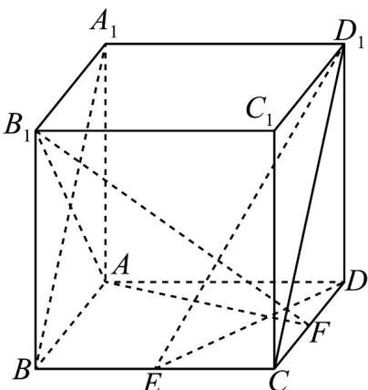

> [!faq]- 《第八章 立体几何初步（高效培优讲义）》官方解析
>
> > [!success]- **【答案】** 点 $F$ 是 $CD$ 的中点
>
> > [!note]- **【分析】**
> > 连接 $A_{1}B$ ， $CD_{1}$ ，DE，证明当点 F 是 CD 的中点时， $D_{1}E \perp$ 平面 $AB_{1}F$
>
> > [!note]- **【解析】**
> > 解：如图，连接 $A_{1}B$ ， $CD_{1}$ ，则 $A_{1}B \perp AB_{1}$ ， $A_{1}D_{1} \perp AB_{1}$
> >
> > 
> >
> > 又 $A_{1}D_{1}\cap A_{1}B = A_{1}$ ， $A_{1}D_{1},A_{1}B\subset$ 平面 $A_{1}BCD_{1}$
> >
> > $\therefore AB_{1}\perp$ 平面 $A_{1}BCD_{1}$ . 又 $D_{1}E\subset$ 平面 $A_{1}BCD_{1}$ , $\therefore AB_{1}\perp D_{1}E$ .
> >
> > 于是 $D_{1}E^{\perp}$ 平面 $AB_{1}F \Leftrightarrow D_{1}E^{\perp}AF$ .
> >
> > 连接 DE，则 DE 是 $D_{1}E$ 在底面 ABCD 内的射影。
> >
> > $$
> > \therefore D _ {1} E \perp A F \Leftrightarrow D E \perp A F.
> > $$
> >
> > ∵ABCD 是正方形，E 是 BC 的中点，
> >
> > ∴当且仅当 F 是 CD 的中点时， $DE \perp AF$ ，
> >
> > 即当点 F 是 CD 的中点时， $D_{1}E^{\perp}$ 平面 $AB_{1}F$ .
