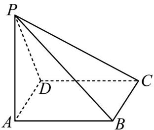

<!-- question-source:start -->
【变式1】如图，已知四棱锥 P-ABCD 的外接球 O 的体积为 $36\pi$ ，PA=3，侧棱 PA 与底面 ABCD 垂直，四

边形ABCD为矩形，点 $M$ 在球 $O$ 的表面上运动，求四棱锥 $M - ABCD$ 体积的最大值

<!-- question-source:end -->

![[高中/课堂同步/题库/人教A版高中数学同步讲义(2026)/02_必修第二册/第八章 立体几何初步/第八章 立体几何初步（高效培优讲义）/题型09_证明线面垂直/questions/answers/Q00069950A1.md]]
