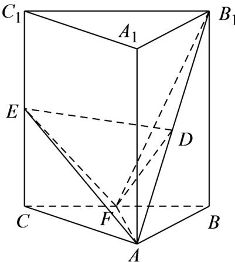

<!-- question-source:start -->
【变式2】如图，三棱柱 $ABC - A_{1}B_{1}C_{1}$ 中，侧棱 $AA_{1}\perp$ 平面 $ABC$ ， $\forall ABC$ 为等腰直角三角形， $\angle BAC = 90^{\circ}$

且 $AB = AA_{1}$ ， $D$ ， $E$ ， $F$ 分别是 $B_{1}A$ ， $CC_{1}$ ， $BC$ 的中点.

(1)求证： $B_{1}F \perp$ 平面 AEF；

(2)设 $AB = a$ ，求三棱锥 $D - AEF$ 的体积.
<!-- question-source:end -->

![[高中/课堂同步/题库/人教A版高中数学同步讲义(2026)/02_必修第二册/第八章 立体几何初步/第八章 立体几何初步（高效培优讲义）/题型09_证明线面垂直/questions/answers/Q00069951A1.md]]
