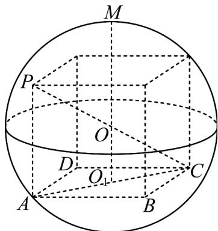

> [!faq]- 《第八章 立体几何初步（高效培优讲义）》官方解析
>
> > [!success]- **【答案】** $\frac{81}{4}$
>
> > [!note]- **【分析】**
> > 由球的表面积求出半径，将四棱锥 $P - ABCD$ 补成长方体，长、宽、高分别设为 $a$ 、 $b$ 、 $c$ ，则
> >
> > $ab \leq \frac{27}{2}$ ，可得矩形 ABCD 面积的最大值，再求出四棱锥 M - ABCD 高的最大值，得到体积的最大值。
>
> > [!note]- **【解析】**
> > 设球 O 的半径为 R，则 $\frac{4}{3}\pi R^{3}=36\pi$ ，故 R=3.
> >
> > 因为 $PA \perp$ 平面 $ABCD$ ， $AB, AD \subset$ 平面 $ABCD$ ，所以 $PA \perp AB, PA \perp AD$
> >
> > 又因为四边形 ABCD 为矩形，则 PA，AB，AD 两两垂直，
> >
> > 所以将四棱锥 P-ABCD 补成长方体，可知外接球的直径即为长方体的体对角线，
> >
> > 设长方体的长、宽、高分别为 a, b, c，则 c = 3，
> >
> > 因为 $a^{2}+b^{2}+3^{2}=6^{2}$ ，所以 $a^{2}+b^{2}=27$ ，
> >
> > 又 $a^2 + b^2 = 2ab$ ，所以 $ab \leq \frac{27}{2}$ ，当且仅当 $a = b = \frac{3\sqrt{6}}{2}$ 时，等号成立。
> >
> > 要使得四棱锥 $M - ABCD$ 的体积最大，
> >
> > 只需点 M 为过平面 ABCD 的中心 $O_{1}$ 与球心 O 的直线与球的交点（点 M、 $O_{1}$ 在球心 O 两侧），
> >
> > 又 $OO_{1}=\frac{1}{2}PA=\frac{3}{2}$
> >
> > 所以四棱锥 M-ABCD 体积的最大值为 $\frac{1}{3}\times\frac{27}{2}\times\left(\frac{3}{2}+3\right)=\frac{81}{4}$
> >
> > 
