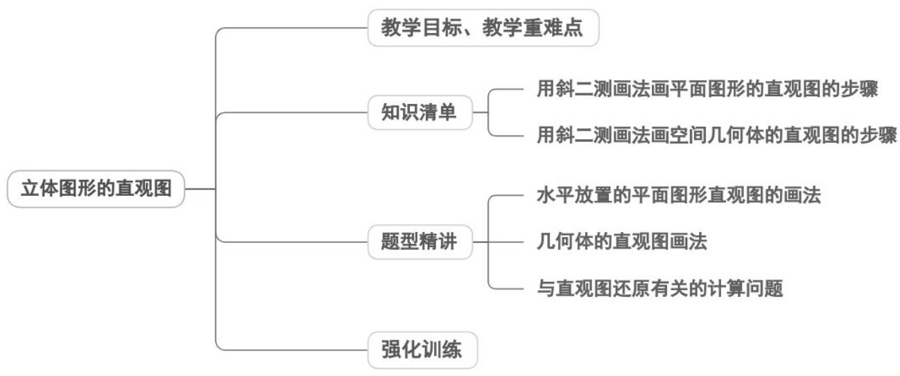

## 专题8.2 立体图形的直观图

## 内容概览

## 教学目标、教学重难点

<table><tr><td>教学目标</td><td>1.理解直观图的含义与绘制意义,掌握斜二测画法的核心规则,知晓平面图形与空间几何体直观图的绘制关联。2.能熟练用斜二测画法绘制简单平面图形(正三角形、矩形、梯形等)和简单空间几何体(棱柱、棱锥、圆柱、圆锥等)的直观图,能根据直观图还原简单平面图形的实际形状。3.体会“数形结合”“转化与化归”思想(将空间几何体转化为平面图形绘制),感悟“直观感知与规范作图”结合的几何研究方法。</td></tr><tr><td>教学重难点</td><td>1.重点用斜二测画法绘制常见简单空间几何体(棱柱、棱锥、圆柱、圆锥)的直观图。2.难点能根据直观图,结合斜二测画法规则还原原图的形状与度量,建立直观图与原图的度量</td></tr></table>

关联。
