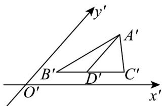

<!-- question-source:start -->
4. 如图， $\triangle A'B'C'$ 是斜二测画法画出的水平放置的 $\mathrm{VABC}$ 的直观图， $D^{\mathfrak{c}}$ 是 $B'C'$ 的中点，且 $A'D' / / y'$ 轴，

$B^{\prime}C^{\prime}\parallel x^{\prime}$ 轴， $A^{\prime}D^{\prime}=1$ ， $B^{\prime}C^{\prime}=2$ ，则 VABC 的面积为 \_\_\_\_。

<!-- question-source:end -->

![[高中/课堂同步/题库/人教A版高中数学同步讲义(2026)/02_必修第二册/第八章 立体几何初步/讲义/专题8_2_立体图形的直观图_高效培优讲义_/强化训练_sec_06/questions/answers/Q00065157A1.md]]
