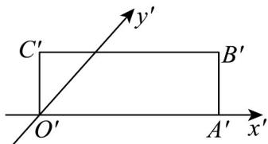

> [!faq]- 《专题8_2_立体图形的直观图_高效培优讲义_》官方解析
>
> > [!success]- **【答案】**  A 3 B $3\sqrt{2}$ C 6 D $6\sqrt{2}$
>
> > [!note]- **【分析】**
> > 根据直观图和原图形面积之间的关系求解即可·
>
> > [!note]- **【解析】**
> > 直观图矩形 $O'A'B'C'$ 的面积 $S' = O'A' \cdot O'C' = 3 \times 1 = 3$ ，则原图面积 $S = 2\sqrt{2} S' = 6\sqrt{2}$ ，
> >
> > 故选 **D**
