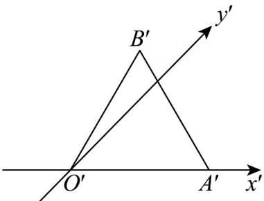
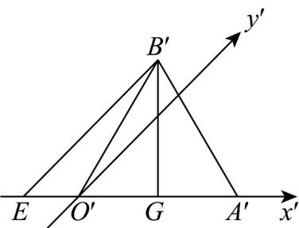

> [!faq]- 《专题8_2_立体图形的直观图_高效培优讲义_》官方解析
>
> > [!success]- **【答案】**  A. $\frac{\sqrt{6}}{8} a^2$ B. $\frac{\sqrt{3}}{4} a^2$ C. $\frac{\sqrt{6}}{4} a^2$ D. $\frac{\sqrt{6}}{2} a^2$
>
> > [!note]- **【分析】**
> > 求出原图中 B 到 OA 的距离后可求原图的面积.
>
> > [!note]- **【解析】**
> > 
> >
> > 过 $B^{\prime}$ 作 $y^{\prime}$ 轴的平行线，交 $x^{\prime}$ 轴于 $E$ ，过 $B^{\prime}$ 作 $B^{\prime}G$ 垂直于 $x^{\prime}$ 轴于 $G$ ，则 $B^{\prime}G = \frac{\sqrt{3}}{2} a$ ，而 $\angle B^{\prime}EG = 45^{\circ}$ ，故 $B^{\prime}E = \frac{\sqrt{6}}{2} a$
> >
> > 设对应的原图为 $\triangle OAB$ ，故 $OA = a$ ，且 $B$ 到 $OA$ 的距离为 $\sqrt{6}a$ ，
> > 故其面积为 $\frac{1}{2} \times a \times \sqrt{6}a = \frac{\sqrt{6}}{2}a^2$ .
> >
> > 故选 **D**.
