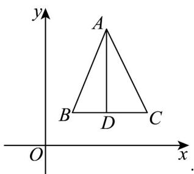

> [!faq]- 《专题8_2_立体图形的直观图_高效培优讲义_》官方解析
>
> > [!success]- **【答案】** 2
>
> > [!note]- **【分析】**
> > 根据斜二测法，由直观图可作出原图形，再求面积即可·
>
> > [!note]- **【解析】**
> > 根据题意可作出原图形，
> >
> > 
> >
> > $$
> > S _ {\triangle A B C} = \frac {1}{2} B C \cdot A D = \frac {1}{2} \times 2 \times 2 = 2
> > $$
> >
> > 故答案为：2.
