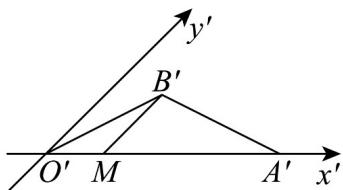

> [!faq]- 《专题8_2_立体图形的直观图_高效培优讲义_》官方解析
>
> > [!success]- **【答案】** C
>
> > [!note]- **【分析】**
> > 根据等式确定 $\angle B'O'A' = \angle B'A'O' = 30^{\circ}$ ，然后作辅助线，利用正弦定理求出 $B'M$ 的值，进而可求出 $OA_{\text{边上的高}}$
>
> > [!note]- **【解析】**
> > 因为 $O'B' = A'B' = 2, O'A' = 2\sqrt{3}$ ，易知 $\angle B'O'A' = \angle B'A'O' = 30^\circ$
> >
> > 过 $B'$ 作 $y'$ 轴的平行线交 $x'$ 轴于 M 点，则 $\angle B'MA'=45^{\circ}$
> >
> > 由正弦定理可知 $\frac{A'B'}{\sin 45^\circ} = \frac{B'M}{\sin 30^\circ}$ ，则 $B^{\prime}M = \sqrt{2}$
> >
> > 由斜二测画法知原平面图形中，OA 边上的高为 $2B'M = 2\sqrt{2}$
> >
> > 故选：C.
> >
> > 
