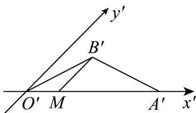
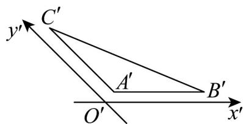
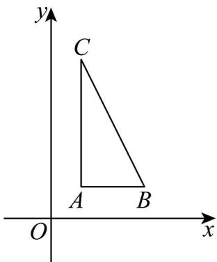

> [!faq]- 《专题8_2_立体图形的直观图_高效培优讲义_》官方解析
>
> > [!success]- **【答案】** A
>
> > [!note]- **【分析】**
> > 过 $B^{\prime}$ 作 $y^{\prime}$ 的平行线交 $x^{\prime}$ 于 $M$ 点，解三角形计算 $B^{\prime}M$ 结合斜二测画法的意义即可得出结果
>
> > [!note]- **【解析】**
> > 
> >
> > 过 $B'$ 作 $y'$ 的平行线交 $x'$ 于 $M$ 点，则易知 $\angle B'M A' = 45^{\circ}$ ，
> >
> > 由正弦定理可知 $\frac{|A'B'|}{\sin 45^\circ} = \frac{|B'M|}{\sin 30^\circ}$ ，则 $|B'M| = \sqrt{2}$
> >
> > 由斜二测画法知：在原平面图形中，顶点 B 到 x 轴的距离是 $2\left|B'M\right|=2\sqrt{2}$
> >
> > 故选：A
> >
> > 10. VABC 的直观图 $\triangle A^{\prime}B^{\prime}C^{\prime}$ 如图所示，其中 $A^{\prime}B^{\prime} \parallel x^{\prime}$ 轴， $A^{\prime}C^{\prime} \parallel y^{\prime}$ 轴，且 $\left|A^{\prime}B^{\prime}\right| = \left|A^{\prime}C^{\prime}\right| = 2$ ，则 VABC 的面
> >
> > 积为\_\_\_\_。
> >
> > 
> >
> > 【答案】4
> >
> > 【分析】将直观图还原为原图，如图所示，进而求解·
> >
> > 【详解】将直观图还原为原图，如图所示，
> >
> > 
> >
> > 则VABC是直角三角形，其中 $AC = 4, AB = 2$
> >
> > 故VABC的面积为 $S_{\triangle ABC} = \frac{1}{2} \times 4 \times 2 = 4$
> >
> > 故答案为：4.
