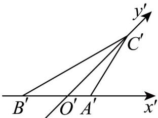

> [!faq]- 《专题8_2_立体图形的直观图_高效培优讲义_》官方解析
>
> > [!success]- **【答案】**  A. $\sqrt{2}$ B. $\sqrt{3}$ C. $\sqrt{6}$ D. $2\sqrt{6} - 2\sqrt{2}$
>
> > [!note]- **【分析】**
> > 涉及余弦定理以及斜二测画法的相关知识·首先，根据已知条件 $a^{\prime 2} - c^{\prime 2} = b^{\prime}c^{\prime} + b^{\prime 2}$ ，利用余弦定理求出角 $A'$ 的大小·然后，由斜二测画法的性质，得到原三角形VABC的相关信息，进而求出AB边上的高·【详解】已知在 $\triangle A'B'C'$ 中， $a^{\prime 2} - c^{\prime 2} = b^{\prime}c^{\prime} + b^{\prime 2}$ ，移项可得 $a^{\prime 2} = b^{\prime 2} + c^{\prime 2} + b^{\prime}c^{\prime}$
>
> > [!note]- **【解析】**
> > 根据余弦定理 $\cos A'=\frac{b'^{2}+c'^{2}-a'^{2}}{2b'c'}$ ，将 $a'^{2}=b'^{2}+c'^{2}+b'c'$ 代入可得：
> > $\cos A' = \frac{b'^2 + c'^2 - (b'^2 + c'^2 + b'c')}{2b'c'} = \frac{-b'c'}{2b'c'} = -\frac{1}{2}.$
> > 因为 $0^{\circ} < A' < 180^{\circ}$ ，所以 $A' = 120^{\circ}$ .
> > 已知 $b' = 1$ ，即 $A'C' = 1$ ，那么 $\triangle A'B'C'$ 中 $A'B'$ 边上的高 $h' = A'C'\sin 60^\circ = 1 \times \frac{\sqrt{3}}{2} = \frac{\sqrt{3}}{2}$ .
> > 根据斜二测画法的性质，在斜二测画法中，平行于 $y$ 轴的线段长度变为原来的一半，
> > 那么原三角形VABC中AB边上的高 $h=OC=2O'C'=2\sqrt{2}h'$
> > 将 $h'=\frac{\sqrt{3}}{2}$ 代入可得 $h=2\sqrt{2}\times\frac{\sqrt{3}}{2}=\sqrt{6}$
> > 所以 VABC 中 AB 边上的高为 $\sqrt{6}$ .
> >
> > 故选 **C**.
