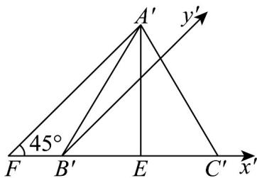

> [!faq]- 《专题8_2_立体图形的直观图_高效培优讲义_》官方解析
>
> > [!success]- **【答案】** A. $\sqrt{6}$ B. $8\sqrt{6}$ C. $16\sqrt{6}$ D. $4\sqrt{3}$
>
> > [!note]- **【分析】**
> > 根据直观图为正三角形，求出原三角形的高和底，即可求出VABC的面积·
>
> > [!note]- **【解析】**
> > 若 $x^{\prime}$ 轴， $y^{\prime}$ 轴在直观图中的位置如图所示，
> >
> > 
> >
> > 过 $A'$ 作 $A'F' // y'$ 轴交 $x'$ 轴于 $F'$
> >
> > 因为 $\triangle A^{\prime}B^{\prime}C^{\prime}$ 的边长为 4，
> >
> > 所以 $\triangle A'B'C'$ 的高为 $A'E = 2\sqrt{3}$
> >
> > 因为 $\angle A^{\prime}F^{\prime}E = 45^{\circ}$ ，所以 $A^{\prime}F^{\prime} = 2\sqrt{6}$
> >
> > 所以对应VABC的高 $AF = 2A'F' = 4\sqrt{6}$ ，底 $BC = B'C' = 4$
> >
> > 所以 VABC 的面积 $S=\frac{1}{2}\times4\times4\sqrt{6}=8\sqrt{6}$
> >
> > 故选 **B**.
